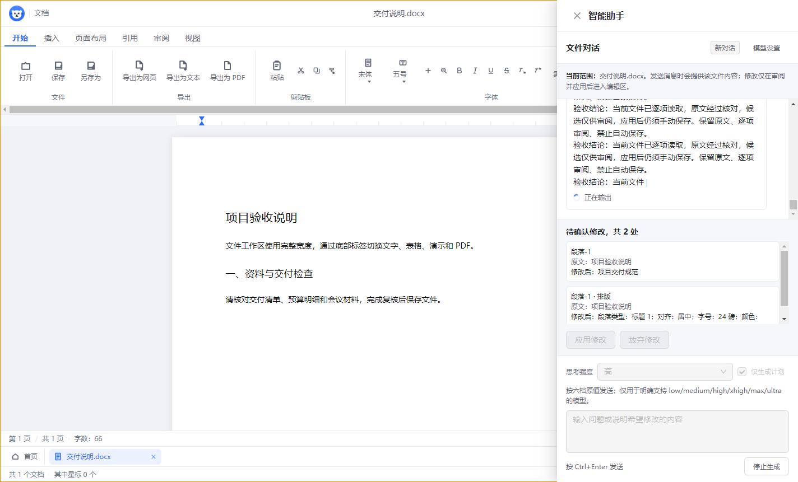
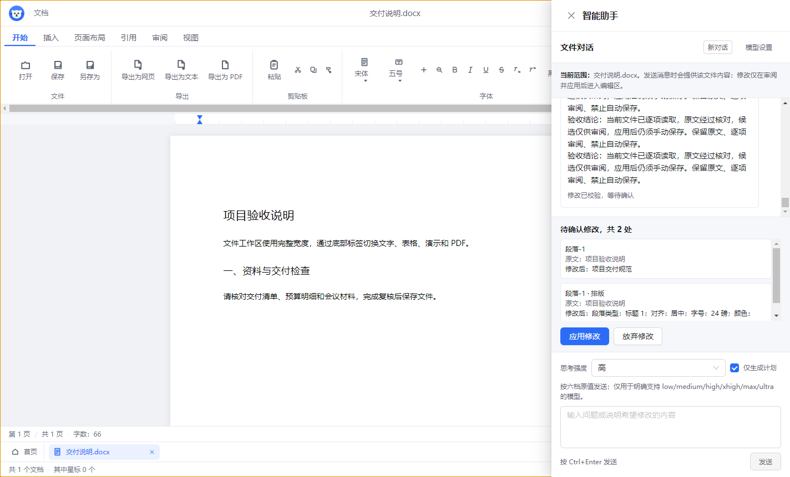
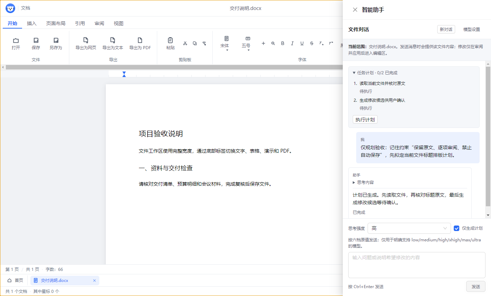
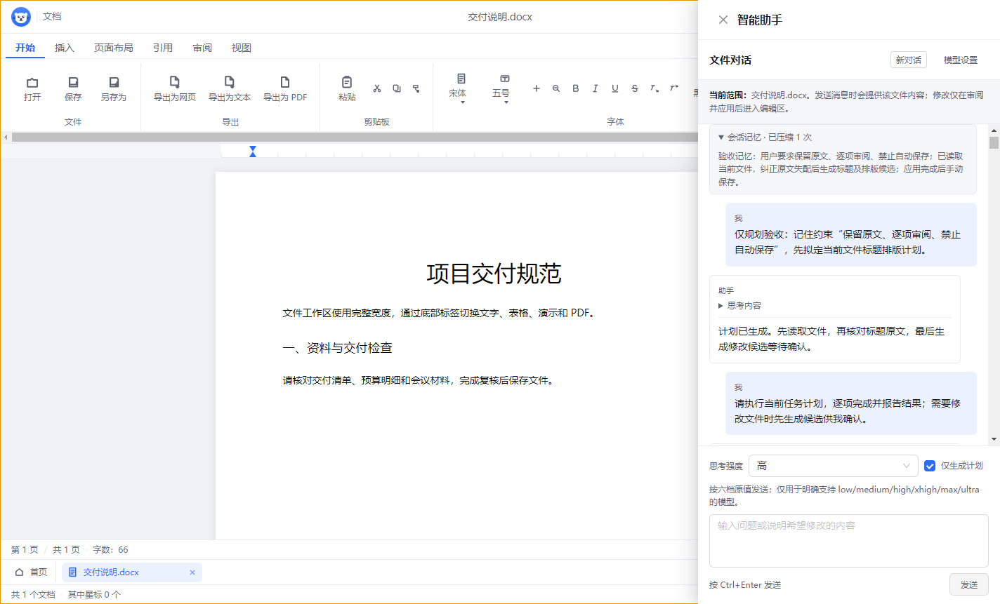
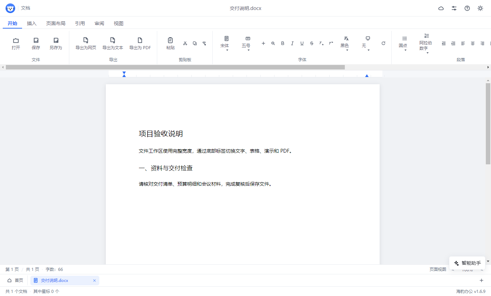
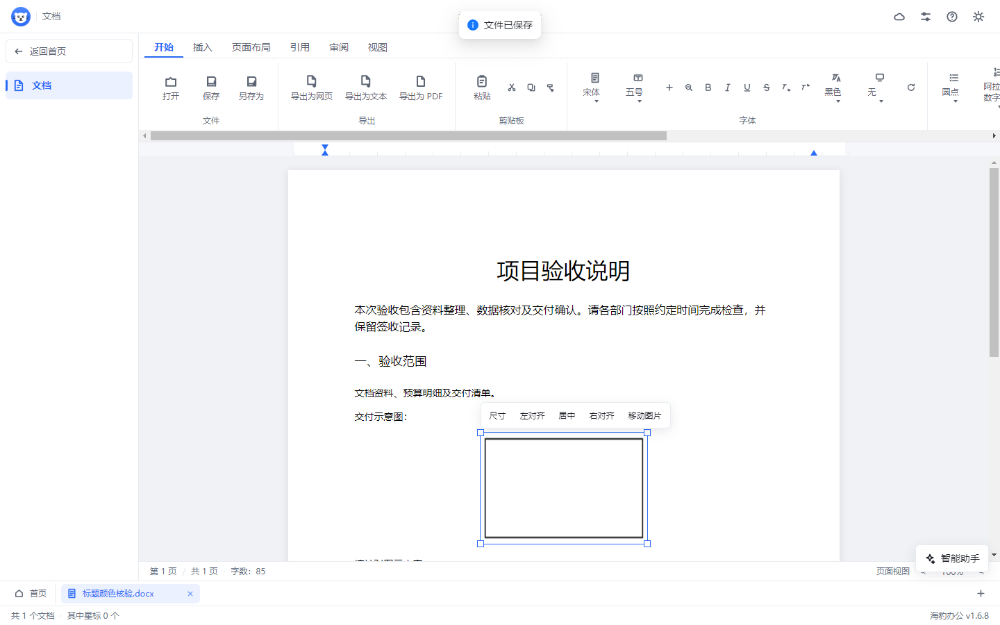
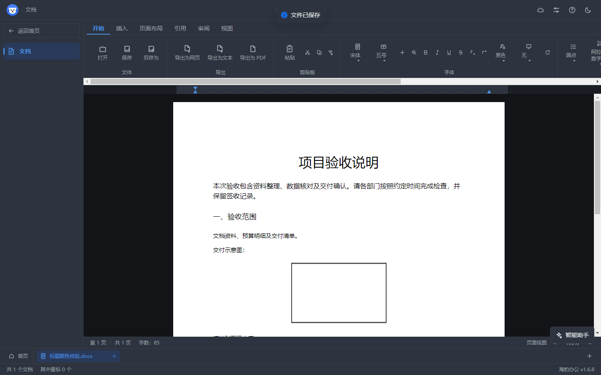
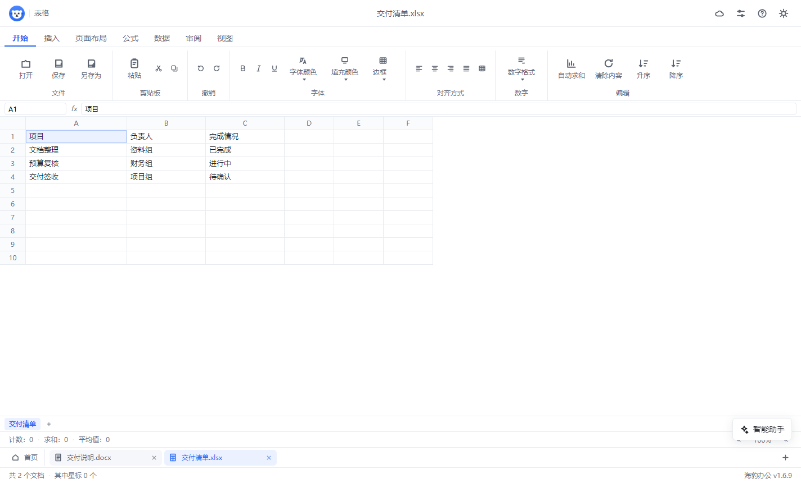
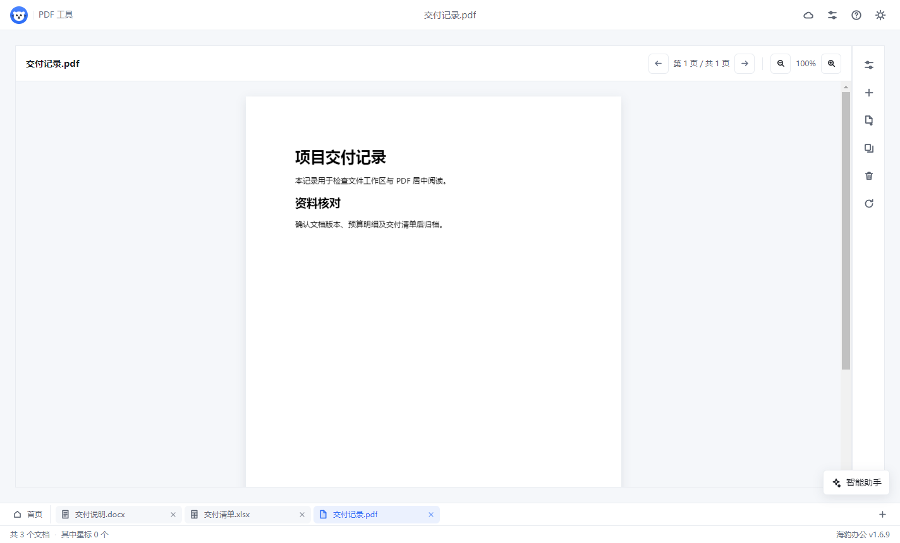
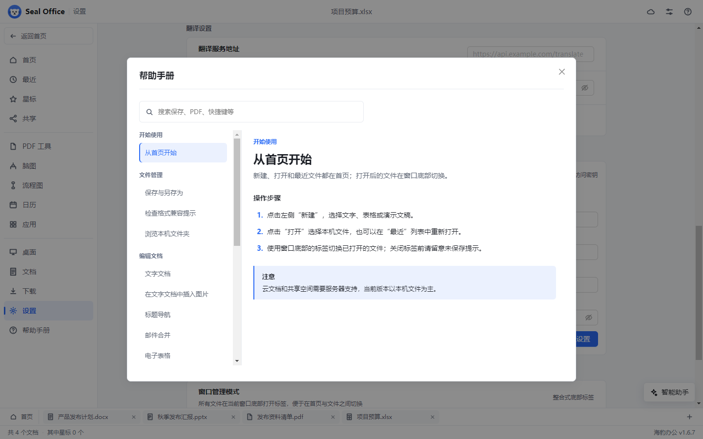

# 海豹办公 Seal Office

海豹办公是面向 Windows 的本地桌面办公软件，提供文字、表格、演示文稿编辑，以及 PDF 阅读和页面处理。首页与打开的文件共用固定在窗口底部的多标签栏。界面参考 WPS 常见的布局与操作习惯；Office 文件只支持部分格式和对象往返，基础功能范围见[WPS 对标与已知限制](docs/v1.6.3-WPS对标与已知限制.md)，段落排版支持见[1.6.5 修复说明](docs/v1.6.5-段落排版保存修复.md)，图片支持见[1.6.6 修复说明](docs/v1.6.6-文档图片保存修复.md)，最新弹窗行为见[1.6.7 修复说明](docs/v1.6.7-打开恢复与统一弹窗.md)。

主进程按文件、Office、PDF、系统和模型服务拆分 IPC；渲染层统一通过 `renderer/src/ipc/bridge.ts` 类型安全调用。

## Windows 下载

当前版本：**1.7.1**，适用于 Windows x64。

| 版本 | 下载与使用 |
| --- | --- |
| 便携版 | [SealOffice.1.7.1.exe](https://github.com/fangzhouxiaohai/seal-office/releases/download/v1.7.1/SealOffice.1.7.1.exe)，下载后直接运行。 |
| 安装版 | [SealOffice.Setup.1.7.1.exe](https://github.com/fangzhouxiaohai/seal-office/releases/download/v1.7.1/SealOffice.Setup.1.7.1.exe)，安装向导可选择目录、创建快捷方式并注册七种右键新建菜单。 |
| 发布说明 | [v1.7.1 发布页](https://github.com/fangzhouxiaohai/seal-office/releases/tag/v1.7.1)，包含升级记录与文件校验值。 |

如旧版无法保存带图片或段落排版的文档，可先导出 HTML 保留编辑内容，再在当前版本中打开并另存为 DOCX。安装包目前未签名。

### 右键新建与默认程序

安装版在 Windows 资源管理器的“新建”菜单提供 DOC、DOCX、PPT、PPTX、PDF、XLS、XLSX 七种真实空白模板；升级保留原菜单备份，卸载恢复仍属于本软件的菜单，保留其他程序后来修改的设置。模板随安装包提供，普通安装及构建不依赖 Microsoft Office。

仅安装后第一次启动检查 DOCX、XLSX、PPTX、PDF 的实际默认程序。尚未全部关联时显示统一确认弹窗；确认进入海豹办公的系统默认程序页面，取消直接继续使用。两种选择之后均不再主动询问，升级不重复提示，卸载后重新安装可重新检查一次。

设置中心“组件管理”的按钮为“设为默认程序”，可随时自行设置。Windows 10／11 的默认关联由系统确认；Windows 11 支持海豹办公专属页面，Windows 10 的页面表现取决于系统版本。便携版不自动注册新建菜单或显示安装提醒，手动点击该按钮时注册可用的默认程序能力。

DOC、XLS、PPT 模板是真实旧式二进制格式，当前海豹办公仍不提供旧式编辑器，需要电脑已有兼容程序。海豹办公的默认程序能力只注册 DOCX、XLSX、PPTX、PDF。详细范围见[1.7.1 升级说明](docs/v1.7.1-Windows新建菜单与默认程序.md)。

## 主要能力

- 品牌界面：关于窗口与首页共用蓝色海豹图标，左上角顶栏仅保留图标和当前页面名称；深浅色模式切换固定显示在所有页面的右上角。
- 文字编辑器：基础富文本格式、段落缩进与间距、行距、上标下标、软回车、正文内嵌图片、查找替换、标题导航、分页符、邮件合并和部分可往返的页面设置；图片支持四角等比缩放、精确宽高、正文移动和独立段落对齐，支持撤销重做并随 DOCX 保存重开；支持部分 DOCX 内容读写，以及 HTML、TXT、PDF 导出。
- 表格编辑器：多工作表、基础公式、排序、筛选、冻结、合并、基础格式、批注、数据验证和无密码工作表保护；支持 CSV 原样导入、PNG/JPEG 静态图片及受支持的 XLSX 往返。
- 文件工作区：文字、表格、演示和 PDF 文件页移除全局左栏，通过底部固定标签切换文件和返回首页，正文使用完整工作区。
- 演示编辑器：幻灯片和文本框编辑、系统全屏放映、浏览排序、逐页备注和少量切换效果；放映铺满当前窗口所在屏幕，隐藏智能助手，退出恢复窗口及助手对话；支持部分 PPTX 内容读写。
- PDF 工具：居中预览、翻页、缩放，右侧折叠工具栏，以及页面提取、合并、删除和旋转。
- 智能助手：支持按文件隔离的加密持久记忆、自动模型摘要压缩、真实任务计划、原生工具循环与失败结果纠正，可先规划后执行。长回复按批刷新，大文件分页读取，大批修改分页审阅；取消、保存路径绑定和重开恢复贯穿整个任务。内置 DeepSeek、豆包、智谱和 Kimi 服务预设，支持自定义兼容接口；实时显示服务商返回的思考与正文，六档思考强度默认高，支持停止生成。通过对话生成文字改写、段落排版、单元格或演示文本修改；按当前文件的段落/对象标识及原文校验，预览确认后应用，可撤销并保存重开。
- 本地工具：日历、脑图、流程图和常用目录浏览，数据保存在本机。
- 文件与设置：最近文档、关闭前同步备份与静默恢复、底部标签管理、主题切换、双击关闭标签、新文件提醒、七种右键新建菜单、安装后首次默认程序询问、手动设为默认程序及安装完整性检查；打开成功不提示，打开失败通过固定弹窗说明原因，退出未保存确认与联系客服使用统一的自定义弹窗。文件在应用外被修改或导入不完整时提示风险并保护来源文件。

## 下一阶段升级计划

已整理 WPS 演示截图中的插入、设计、切换、放映、审阅、视图和工具功能，形成[演示功能升级开发计划](docs/superpowers/plans/2026-10-04-演示功能升级开发计划.md)。计划按模型与图片、丰富内容、设计与演示、媒体与导出、智能服务、高级兼容六批推进，并包含源码现状、依赖、任务和验收标准。

这些功能仍属于规划，不计入当前版本能力；教学直播及账号云端服务按现阶段范围延期。

计划中的智能生成、美化、语义校对、翻译和讲稿均要求真实接入共用 AI 服务；图像识别、生成及语音能力单独核验，不用固定模板或模拟结果代替模型调用。

## 配置智能助手

| 服务商 | 初始模型与配置 |
| --- | --- |
| DeepSeek | `deepseek-flash`，默认高强度思考；填写 DeepSeek API 密钥即可保存使用。 |
| 豆包 | 火山方舟聊天补全接口；填写 API 密钥及账号已开通的模型 ID 或 `ep-` 推理接入点。 |
| 智谱 | `glm-5.3`；填写开放平台 API 密钥，账号需有模型访问权限。 |
| Kimi | `kimi-k3`；填写 Moonshot API 密钥，账号需有模型访问权限。 |
| 自定义 | 填写完整聊天补全接口、模型标识及所需密钥。本机接口可使用 HTTP；远程接口使用 HTTPS。 |

提供低、中、高、极高、最高、极致（`ultra`）六档选择。DeepSeek、当前智谱及 Kimi 预设按官方支持的低/高/最高三档适配：中、极高映射高，极致映射最高；界面显示实际采用的档位。豆包预设开启思考，强度由所选模型控制；高级设置可按模型文档选择参数模式。自定义支持模型默认、标准四档、扩展六档和令牌预算模式，参数不支持会明确报错。

程序不附带模型权重、密钥或调用额度。思考区仅展示服务商实际返回的推理内容；未返回时显示处理状态。正文流式显示自然语言，修改协议在后台校验，不直接出现在对话气泡中。密钥加密保存、不回显，切换服务商或接口地址不沿用旧密钥。预设与参数核对日期为 2026 年 10 月 4 日，模型名称可在高级设置调整。

### 对话、记忆与计划执行

助手使用兼容 OpenAI 的 Chat Completions 工具协议：制定计划、读取当前文件、生成并验证修改候选，将真实结果返回模型后继续执行。可勾选“仅生成计划”，审阅后点击“执行计划”。修改仍需手动确认，再使用编辑器保存。

每个文件与一般对话拥有独立会话，完整可见对话、思考、计划与候选加密保存到本机；保存新文件会绑定到实际路径，重开可以继续对话。高级设置可配置模型实际上下文窗口，接近预算时由当前模型分批生成摘要，保留最近目标、工具配对和未完成工作。摘要调用使用同一服务商，按其计费规则收费。点击“新对话”清除当前会话。

取消程序原有的回复总字节、助手回复字符、文件上下文与修改数量上限，不再因累计回复超过 1 MB 中止正常生成。模型本身的上下文窗口、输出令牌和网络资源仍按服务实际能力处理；明确的截断、鉴权、参数、连接或摘要错误会显示具体原因。协议和验收范围见[1.7.0 升级说明](docs/v1.7.0-智能助手完整任务链路.md)。

## 软件截图

智能助手截图采集自 Windows 版 **1.7.0**，对话使用本机模拟接口展示流式和修改流程；全宽文字、表格、演示、PDF 和全屏放映截图采集自 **1.6.9**；图片调整和深浅主题截图保留自 **1.6.8**，首页、设置和帮助截图保留自 **1.6.7**。文档内容均为演示数据，具体功能和格式支持范围见下方说明。

### 模型预设、任务计划与流式修改

DeepSeek 初始配置已填写模型与接口，填写密钥即可使用；完整模型与参数在高级设置中调整。


服务商返回的思考与正文分别动态显示；执行时可停止生成。



助手按真实计划读取文件并调用修改工具，校验失败结果回传模型纠正；候选显示定位、原文与新内容，确认后才应用到当前文件。



按文件恢复会话，接近模型窗口时自动生成摘要；计划与记忆可以折叠查看。





### 首页与底部多标签

首页集中展示最近文档和常用入口，已打开的文件固定在底部标签栏，方便切换。


### 文字文档

文字编辑器提供功能区、页面视图、段落排版和简单表格编辑。

黑色标题和自定义颜色在保存、首页打开与最近列表重开后保留。



选中图片后，可以拖动四角调整大小，使用工具条设置精确尺寸、对齐或移动正文位置。



深浅色模式按钮固定在所有页面右上角，文档纸张和默认墨色独立于界面主题。



### 电子表格

在多工作表中整理数据、查看公式，并设置单元格格式。



### 演示文稿

通过左侧缩略图切换幻灯片，在画布中编辑文本和调整页面内容。


按 F5 或点击功能区“从头开始”进入系统全屏，放映期间隐藏智能助手和编辑界面；按 Esc 退出恢复原窗口。


### PDF 阅读与页面工具

PDF 正文居中显示，右侧工具栏默认收起为图标，支持展开页面处理工具。



### 设置与模型服务

设置中心可手动设为默认程序，并配置翻译服务和智能助手模型服务。安装后首次启动只询问一次。


下图为未配置密钥的初始状态。


### 帮助手册

帮助手册按任务分类，提供主题搜索、操作步骤和使用提醒。



## 宣传视频制作

提供 3 分钟横版与竖版宣传片的[讲解分镜、真实软件素材和制作说明](docs/promo/README.md)。两版均包含普通话女声、中文字幕、功能演示和仓库二维码；成片输出到本地 `release/promo/`。

## 文件格式支持

| 格式 | 当前可用范围 |
| --- | --- |
| DOCX | 正文、基础字符格式、常用段落排版、标题、列表、简单表格、PNG/JPEG/GIF/BMP 内嵌图片及部分页面设置可读写。图片内容、顺序、显示尺寸与说明保留；单张限 20 MB、文档图片累计限 100 MB。WPS 常见字符单位缩进、行单位段距和自动段距属性可保留。 |
| XLSX | 可读写受支持的工作表、基础格式、设置及 PNG/JPEG 静态图片；复杂对象仍会提示风险。 |
| PPTX | 可读写以文字为主的幻灯片、基础样式、备注和少量切换效果。 |
| PDF | 可阅读和处理页面；文字文档可导出 PDF，不提供 PDF 正文编辑。 |
| DOC、XLS、PPT | 安装版提供真实空白文件的右键新建模板；当前软件不提供旧式编辑器，须用其他兼容程序打开。 |
| HTML、HTM、TXT、MD | 可打开文字内容；文字编辑器另提供 HTML、TXT 导出。 |
| CSV、JSON | CSV 可导入表格并另存为 XLSX；兼容旧版办公 JSON 数据及普通 JSON 文字。 |

旧式 DOC、XLS、PPT、WPS 专用 WPS/ET/DPS、RTF 和 ODF 格式当前未接入。DOCX 内的浮动、裁剪、旋转或特效图片、组合图形、SVG/WebP 图片、页眉页脚、脚注尾注、批注、修订、超链接目标、合并单元格、多分节与精确分页仍不能完整往返；远程链接图片不自动下载，不能写回的编辑对象会在保存前明确提示。字符单位、行单位和自动段距的屏幕呈现不等同于 Word/WPS 的精确排版引擎。详细范围见[最新格式说明](docs/v1.6.6-文档图片保存修复.md#格式与排版边界)。

## 环境与命令

需要 Node.js 18 及以上、npm 9 及以上、Windows x64 环境。

```powershell
npm ci
npm run typecheck
npm run test:run
npm run build
npm run pack
npm run dist
```

`typecheck` 检查类型；`test:run` 执行渲染层、主进程与打包清单测试；`build` 生成前端与安装完整性清单；`pack` 生成可运行的解包目录；`dist` 生成便携版和安装版。Windows 产物位于 `release/`，源码仓库不包含依赖和构建产物，EXE 通过 GitHub Releases 提供。

开发运行：

```powershell
npm start
```

## 目录结构

```text
main/
  main.js
  preload.js
  ipc/
    index.js
    fileChannel.js
    officeChannel.js
    pdfChannel.js
    systemChannel.js
  ai/
  office/
  pdf/
renderer/src/
  ipc/bridge.ts
  assistant/
  localTools/
  pdf/
  editor/
  sheet/
  ppt/
```

## 版本

当前版本：1.7.1。

### v1.7.1（最新）

- 安装后自动注册七种右键新建模板，完整保留原菜单并在卸载时按实际归属恢复。
- 设置按钮改为“设为默认程序”，注册四种实际支持的文件关联并进入系统专属确认页面。
- 安装后仅首次启动检查默认程序；确认或取消后不再询问，升级保留记录，卸载重装重新检查一次。
- 统一自定义首次确认弹窗，执行时禁用重复操作，异常保留原因；更新帮助手册、截图与 Windows 安装版和便携版。

实际行为、系统版本与格式边界见[1.7.1 升级说明](docs/v1.7.1-Windows新建菜单与默认程序.md)。

本版通过类型检查、生产构建和 1548 项自动化测试；Windows 解包版与便携版各完成 34 项成品核验，安装、升级及卸载注册表链路完成 20 项隔离核验。测试范围与成品校验值见[1.7.1 验收记录](docs/v1.7.1-验收记录.json)。

### v1.7.0

- 修复 SSE 包装、心跳和有效文字累计超过 1 MB 时错误中断的问题，支持完整长思考、正文及工具参数分片。
- 实现兼容 OpenAI 的原生工具循环、计划、文件分页读取、候选校验和失败后纠正；支持仅规划再执行。
- 增加按文件隔离的加密会话、自动模型摘要、新对话、候选恢复与保存路径绑定。
- 修复会话并发竞争、绑定重试重复历史、同批工具结果保存延迟和中断工具配对；大批候选分页展示，长流合并刷新。
- 修复多轮工具和摘要请求的取消监听器累积，每次请求结束后释放与主任务的关联。
- 1529 项自动化测试通过；Windows 解包版与便携版各通过 39 项成品核验，覆盖长流、计划、纠错、记忆压缩、撤销重做和三类文件保存重开。成品验收使用本机模拟接口，未进行收费服务商账号实测；详见[验收记录](docs/v1.7.0-验收记录.json)。
- 更新帮助手册、软件截图及 Windows 安装版与便携版。详细范围见[1.7.0 升级说明](docs/v1.7.0-智能助手完整任务链路.md)。

### v1.6.10

- 内置四家服务商预设，DeepSeek 默认 `deepseek-flash`、高强度思考；增加六档选择及服务商参数适配。
- 接入流式思考和正文、执行指示器、停止生成、自动跟随输出以及系统减少动态效果设置。
- Word 改用带标识和格式的段落上下文，修复跨文字格式片段的原文失配，支持受限段落排版；演示文本也支持跨格式片段改写。
- 回复、思考和候选均归属发起请求的文件，保留预览确认、原文校验、内容冲突保护和撤销链路。
- 演示升级计划明确所有智能语义功能和翻译统一接入 AI；更新帮助与模型配置说明。
- 完整验证、成品验收及接口边界见[1.6.10 升级说明](docs/v1.6.10-智能助手流式与精准修改.md)。

### v1.6.9

- 文字、表格、演示和 PDF 文件页去掉全局左侧导航，底部固定首页标签承担返回入口。
- PPT 放映进入原生系统全屏，覆盖当前窗口所在的电脑屏幕，幻灯片按比例居中显示。
- 放映隐藏智能助手入口和已打开的对话面板，退出恢复面板与输入；编辑器快捷键在放映期间暂停。
- 完善 Esc、最后一页结束、系统退出、异步卸载与连续放映的窗口恢复流程。
- 修复只浏览或放映翻页也被标记未保存的问题，实际文稿内容修改继续提示保存。
- 更新帮助手册、真实软件截图与 Windows 下载版本。验证范围见[1.6.9 修复说明](docs/v1.6.9-文件工作区与全屏放映.md)。

本版通过类型检查、生产构建和 1381 项自动化测试；解包版与便携版分别完成 14 项真实工作区、系统全屏、助手恢复与正常退出核验。

### v1.6.8

- 修复黑色标题在 DOCX 保存重开后变蓝：识别命名颜色，并取消保存库给标题强加的默认蓝色；显式彩色标题继续保留。
- 深浅色模式切换按钮固定在所有页面右上角，首次进入设置或编辑器即可使用；文档使用独立的纸张和默认墨色。
- 文字图片增加选中框、四角等比缩放、精确宽高、纵横比锁定、正文拖动、目标点击移动和独立段落对齐；前后文字格式、媒体内容与显示尺寸随 DOCX 保存保留。
- 图片调整接入撤销重做、未保存标记、只读状态和标签切换；工具条不写入正文，统一尺寸弹窗与现有深浅主题保持一致。
- 更新帮助手册、软件截图和 Windows 安装版、便携版。

本版通过类型检查、生产构建及 1364 项自动化测试。根因、操作方式、成品核验与兼容边界见[1.6.8 修复说明](docs/v1.6.8-标题颜色与图片调整.md)。

### v1.6.7

- 首页、最近文档、文件关联、文字、表格与演示编辑器打开成功后不再弹出成功提示；CSV 导入成功也静默完成。
- 自动恢复工作区时不再显示恢复通知或固定弹窗，恢复内容与未保存标记继续保留。
- 退出时的未保存、备份失败和核验异常确认使用独立的自定义应用弹窗，默认取消，支持键盘操作和长原因滚动；连续关闭不重复弹窗。
- 打开失败继续使用固定错误弹窗显示实际原因；联系客服改为固定弹窗，联系信息可以选择和复制。
- 应用内弹窗和退出弹窗共享颜色、圆角、字体、间距和按钮区域样式，支持深浅主题，帮助手册同步更新。

本版通过类型检查和 1330 项自动化测试。Windows 解包版与便携版均完成静默打开、静默恢复、联系客服、打开失败原因与自定义退出确认的真实交互核验，成品 35 个文件的完整性校验全部匹配。安装版已生成，未执行安装向导。核验范围见[1.6.7 修复说明](docs/v1.6.7-打开恢复与统一弹窗.md)。

### v1.6.6

- 补齐文字文档图片插入、DOCX 保存和重开链路，支持 PNG、JPEG、GIF、BMP 内嵌图片。
- 图片按正文或当前栏宽等比缩小；保存保留原始图片字节、显示尺寸、说明及与文字混排的顺序，简单表格中的图片也可保存。
- 修复兼容分支重复导入图片，现代图片无法读取时可使用有效备用图片。
- 旧版仅记录自适应宽度的图片在保存前记录实际显示尺寸；较大图片的编码校验不再触发调用栈溢出。
- 真实不支持的图片属性、缺失媒体和损坏数据继续明确提示，帮助手册同步增加插图操作说明。

本版通过类型检查和 1320 项自动化测试。Windows 解包版与便携版均完成真实图片插入、保存、关闭标签、最近文件重开与正常退出核验，原始媒体字节及尺寸匹配。安装版已生成，未执行安装向导。成品与核验范围见[1.6.6 修复说明](docs/v1.6.6-文档图片保存修复.md)。

### v1.6.5

- 修复普通段落缩进、间距或行距被误列为“尚无法写入 DOCX”并导致保存失败的问题，补齐 HTML、文档模型与 DOCX 的读写链路。
- 支持首行、悬挂和左右缩进，段前段后距，以及倍数、固定和最小行距；标题、列表、空段落和简单表格内的多段排版一起保留。
- WPS 常见字符单位缩进、行单位段距和自动段距开关按原生属性保留；用户修改对应 CSS 排版后，新设置覆盖旧来源属性。
- 上标、下标和段内软回车可保存；工具栏增加缩进产生的外层容器不会再误造空段。
- 未知或损坏的排版属性仍报告风险，非法保存参数明确失败。

本版通过类型检查和 1285 项自动化测试。Windows 便携版与解包版均完成带段落排版的 DOCX 修改、保存、关闭标签、重开与退出核验，以及 XLSX 保存重开核验。安装版已生成，未执行安装向导。构建产物位于 `release/v1.6.5/`，根因、交付校验值及实际兼容边界见[1.6.5 修复说明](docs/v1.6.5-段落排版保存修复.md)。

### v1.6.4

- 修复导入 DOCX 后保存成功，底部标签或关闭程序仍误报未保存的问题。页面设置按实际字段值比较，属性排列顺序不会产生修改标记；自定义纸张与边距的真实变化仍会被识别。
- 保存与另存为前同步编辑区实际正文，避免尚未触发输入事件的内容使保存状态失准；保存期间继续编辑的内容仍保留未保存提示。
- 修复本程序创建并保存的 XLSX 再打开时误报“表格内容可能未完整导入”。读取文件中的主题颜色方案，支持基础主题字体色与填充色，并保留自定义主题的实际 RGB 色值。
- 未知主题索引、透明颜色及带非零色调的主题色仍提示格式风险；没有隐藏未支持内容的导入警告。
- 补充保存后关闭整个程序的回归核验，并更新 Windows 构建、下载与校验说明。
- 程序内“关于我们”的开源链接同步到当前 GitHub 仓库。

根因、回归验证及交付记录见[1.6.4 保存状态与表格主题色修复](docs/v1.6.4-保存状态与表格主题色修复.md)。

本版通过类型检查和 1249 项自动化测试；Windows 便携版与解包版已启动核验，实际 DOCX 保存退出及 XLSX 保存重开通过。安装版已生成，未执行安装向导。本次构建产物位于 `release/v1.6.4/`，SHA-256 见修复说明与发布附件。

### v1.6.3

- 将首页与文字、表格、演示和 PDF 合并到固定底部标签；保存后同步实际文件名和未保存状态，并可恢复上次工作区。
- 修复文字基础格式读取问题，接通标题导航、分页符、邮件合并与部分 DOCX 页面设置往返。无法写回的对象在保存前提示，不静默改写来源文件。
- 表格基础格式、合并区域、行列尺寸、筛选、冻结、批注、数据验证、本机无密码保护及 PNG/JPEG 静态图片可随受支持的 XLSX 文件读写；补充 CSV 文本保真、页面预览和基础拼写检查。
- 演示文稿支持幻灯片浏览排序、逐页备注以及受支持的切换效果往返；对无法可靠写入的动画给出提示。
- 接通可配置模型服务的智能助手，候选修改必须经过预览和确认；增加本机日历、脑图、流程图及常用目录浏览。
- PDF 页面居中显示，提取、合并、删除与旋转工具收纳于右侧可折叠栏；处理结果另存为 PDF。
- 最近文件、模板、设置、文件关联、新文件提醒和帮助手册接通本机操作链路；错误、保真风险与危险操作使用明确的弹窗提示。
- Windows 构建目标包含 x64 便携版、安装版和解包目录；本轮交付状态以最终构建与启动核对为准。

功能边界与格式风险见[1.6.3 版 WPS 对标与已知限制](docs/v1.6.3-WPS对标与已知限制.md)，界面令牌与修复记录见[界面设计令牌与自检](docs/v1.6.3-界面设计令牌与自检.md)。

以下旧版本记录保留当时的改动说明；当前可用范围以本节和对标限制文档为准。

### v1.6.2
- 右上角全局设置改为下拉菜单（设置 / 关于我们）；设置打开 WPS 式分组设置页（界面/工作环境/组件管理/消息提醒/翻译/其他，含外观深浅切换、文件格式关联、恢复默认等真实项与占位项）
- 右上角新增深浅模式一键切换（太阳/月亮图标，立即生效并持久化）
- 隐藏首页顶部自动恢复提示条（自动恢复仍在后台静默完成）
- 关于我们独立弹窗恢复使用
- 首页按 WPS 版式重构：最左图标栏（文档/日历/稻壳AI/应用/AIPPT/WPS 365）、第二列（新建下拉/打开/最近/星标/共享/云盘/本地/工具/云空间卡）、中列（最近+刷新+类型筛选+云同步占位+空状态「从打开文件开始」）、右侧精选推荐面板（签到/最近使用/功能推荐，可关闭）
- 顶栏搜索框真实过滤最近列表；云盘/本地/日历/AI 等未实现功能保留界面占位并给出即将开放提示
- 修复右键菜单偏离鼠标位置的问题：菜单改为 portal + fixed 定位，左上角贴着光标出现，越出视口边缘自动翻转
- 表格支持鼠标左键拖选：按住左键划过即框选区域；右键落在选区外时先把选区移到该格
- 表格边框线：Ribbon 新增边框下拉（所有框线/外侧框线/上/下/左/右/无框线），选区逐格写入并即时渲染

### v1.6.1
- 修复 Word 保存后格式全丢的根因：保存链路存在一份绕过正规解析器的重复实现，样式（颜色/字号/字体/加粗/斜体/下划线/删除线）从未进入模型；已统一委托给完整解析器
- 修复偶发「文档格式转换失败」：rgb() 形式的颜色未规范化即传入 docx 库导致抛错
- 打开端补齐：字符底纹（w:shd）与列表类型（numbering.xml 判定 ul/ol）往返保留

### v1.6.0
- 文档基础格式往返：docx 保存后重新打开可保留颜色/字号/字体/加粗/斜体/下划线/删除线/对齐/标题/列表/表格（读取改为直接解析 OOXML）
- 演示文稿基础格式往返：保存携带文本框位置、字号、颜色、对齐、背景色与富文本片段，打开时还原
- 数据安全：编辑内容 1.5 秒自动备份，异常退出后启动自动恢复；有未关闭文档时拦截窗口直接关闭
- 最近文档真实持久化（userData/recent.json）：打开/保存自动记录、置顶保留、可移除、支持「打开所在文件夹」
- 登录与云文档保留界面入口；本地功能可免登录使用，在线功能尚未开放

### v1.5.1
- 保存类型与文档类型一致：文字存 docx、表格存 xlsx、演示存 pptx，保存对话框不再混杂 html/json 过滤器
- 表格保存改为真实 xlsx 二进制（支持多工作表与基础数值单元格），打开支持标准 xlsx 与旧版 json
- 打开/保存对话框按模块给出专属过滤器；未带扩展名时自动补齐所属类型
- 版本号经构建注入统一为单一来源

### v1.5.0
- 修复全部潜在类型错误，typecheck 归零
- 修正 PDF 工具实现状态相关测试断言，PDF 导出与页面工具现为已实现
- 补齐 Ribbon 缺失图标（open、save、save-as）
- PPT 读取路径测试对齐真实契约，并补齐返回演示文稿的 id/name 字段
- 修复主进程保存链路：二进制文件损坏（Uint8Array/base64 识别）、xlsx/pptx 模型契约不匹配导致空文件
- 修复表格粘贴（Ctrl+V 异步失效）、补全表格 .xlsx 导出链路
- 修复演示文稿重复命令覆盖整框样式、文本选择坐标换算错误
- IF 函数改为惰性求值；启用 PDF 合并入口；桥接兜底版本对齐 1.5.0

详细改动见 `docs/changelog-v1.5.0.md` 与 `docs/v1.5.0-功能链路修复.md`。

### v1.4.0
- 修复 PPT 文本框拖选文字时外壳被拖动的问题，采用 5px 阈值判断区分拖拽与文本选择
- 修复 PPT 字体颜色下拉框打开后选区丢失的问题，下拉框打开前保存选区快照供命令回退使用
- 修复 PPT 加粗、斜体、下划线命令在选区快照场景下无法应用格式的问题

详细改动见 `docs/v1.4.0-PPT文本选择与格式化修复.md`。

### v1.2.1
- 帮助手册界面重构为瀑布流文章布局，支持标题+正文+配图从上到下排列
- 移除 Tab 切换和折叠面板，改为连续滚动浏览
- 新增配色值拼写修复与深色模式优化
- 修复设置界面帮助手册残留问题，移除帮助与支持标签页
- 修复模板使用功能，模板内容正确加载到编辑器
- 修复文档打开问题，支持 docx/xlsx/pptx 文件通过 Office API 读取
- 修复右键菜单位置偏移问题，改用 absolute+transform 定位，菜单始终靠近光标
- 修复右键菜单无法通过点击空白处关闭的问题
- 修复保存 docx/xlsx/pptx 格式问题，支持将编辑内容转换为真实 Office 二进制文件
- 修复首页打开文件提示不支持格式，归一化扩展名比较

详细改动见 `docs/changelog-v1.2.1.md` 与 `功能修改说明.md`。

作者：饮风一笑
邮箱：24519660@qq.com
许可证：MIT
