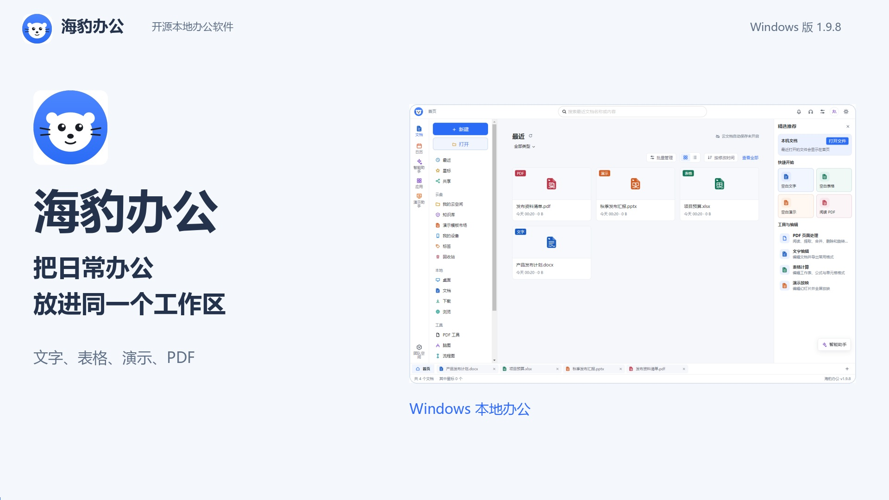

# 海豹办公宣传视频

基于 Windows 版 **1.9.8** 重新录制，替换旧版交付成片。包含文件工作区、文字排版与保存、表格公式、演示放映、原创演示模板市场、PDF 页面工具、新版助手、知识库、云空间入口和本地工具。

## 观看与下载

- [横版宣传片 · 1920 × 1080](https://github.com/fangzhouxiaohai/seal-office/releases/download/v1.9.8/SealOffice1.9.8-PromoLandscape1080p.mp4)
- [竖版宣传片 · 1080 × 1920](https://github.com/fangzhouxiaohai/seal-office/releases/download/v1.9.8/SealOffice1.9.8-PromoPortrait1080p.mp4)
- [中文字幕 SRT](https://github.com/fangzhouxiaohai/seal-office/releases/download/v1.9.8/SealOffice1.9.8-PromoSubtitles.srt)
- [最新版程序与校验文件](https://github.com/fangzhouxiaohai/seal-office/releases/tag/v1.9.8)



## 成片规格

| 项目 | 横版 | 竖版 |
| --- | --- | --- |
| 画幅 | 16:9 | 9:16 |
| 分辨率 | 1920 × 1080 | 1080 × 1920 |
| 时长 | 3 分钟 | 3 分钟 |
| 帧率 | 30 帧/秒 | 30 帧/秒 |
| 视频与音频 | H.264、AAC、MP4 | H.264、AAC、MP4 |

两版使用清晰自然的普通话女声、同步中文字幕和自行合成的低音量伴奏。竖版单独排版，增加操作特写；镜头有短淡入淡出和操作指针。结尾提供仓库地址及直达 1.9.8 下载页的二维码。

## 内容依据

- 软件画面来自已验证的 1.9.8 Windows 成品，录制清单逐项标注版本；缺少最新版素材会报错，不回退到旧图。
- 操作使用独立演示文件和用户数据目录，没有使用个人文档或模型密钥。
- 智能助手使用本机加密会话恢复加载公开示例内容，展示 Markdown、Python 语法高亮、底部复制、设置开合与输入；画面明确标注“示例对话”，没有发起模型请求。
- 知识库展示实际内置原创指南；云空间展示默认关闭的页面与主动开通入口，未登录个人账号、发送短信、上传文件或模拟已开通空间。
- 讲解说明 300 MB 实际配额、客户端加密、恢复密钥自持、自动保存的开通前提、修改先预览和任务队列；PDF 仍以阅读与页面处理为主，复杂文件需要核对兼容提示。
- [讲解与分镜](storyboard.json)保存全部配音文本、视觉令牌与镜头顺序；`assets/` 保存仓库截图及录制关键帧。

## 本地输出

成片及附属材料位于 `release/promo/`，MP4 同步到 GitHub Releases，作为构建产物不提交入源码仓库：

- 海豹办公-横版宣传片-1080p.mp4
- 海豹办公-竖版宣传片-1080p.mp4
- 海豹办公-宣传片字幕.srt
- 海豹办公-宣传片配音.wav
- 横版与竖版封面，以及成片核验记录

## 制作命令

制作脚本位于 `scripts/promo/`。需要 Windows、Python 3.11 及以上、Node.js 22 及以上，以及系统微软雅黑字体。配音调用在线语音服务；运行时请遵循服务条款。

```powershell
python -m pip install -r scripts/promo/requirements.txt
python scripts/promo/prepare_audio.py
node scripts/promo/capture_release.cjs
python scripts/promo/render_video.py --preview
python scripts/promo/render_video.py --mode both
python scripts/promo/verify_video.py
python scripts/promo/publish_video.py
```

录制前，将四个公开演示文件放入 `release/promo/work-v1.9.8/demo/`，文件名为“产品发布计划.docx”“项目预算.xlsx”“秋季发布汇报.pptx”“发布资料清单.pdf”。`capture_release.cjs` 自动启动 `release/v1.9.8/win-unpacked/SealOffice.exe`，使用独立用户数据目录和仅监听本机的动态调试端口，不修改系统文件关联。原始帧、逐词配音时间、来源清单与编码缓存保存在 `release/promo/work-v1.9.8/`。

重新录制特定片段时，例如 `node scripts/promo/capture_release.cjs assistant`，其余同版本素材可复用。发布脚本要求 Git 工作区干净、HEAD 已推送到两个远端，并核对成片报告和现有 1.9.8 程序发布；它仅更新宣传素材，保持应用安装包及已发布版本标签。

需要代理时，可给配音脚本传入 `--proxy` 参数。脚本按讲解内容校验配音缓存，不记录访问凭据。发布到视频平台前，可按平台要求选用相应画幅。

## 画面自检与修正

1. 修正品牌标识的透明底，避免黑色边角。
2. 按语义调整横版标题断行，避免孤字落在下一行。
3. 重新选择竖版特写的关键帧与裁切范围，完整展示代码正文、复制按钮和开通弹窗。

交付前检查两版尺寸、180 秒时长、5400 帧、完整音视频解码、字幕时间范围、音频响度、录制版本、程序归档校验及成片二维码。此次两版均通过，含 87 段字幕，响度约 -16 LUFS；发布后逐个下载核对六个附件的 SHA-256。
