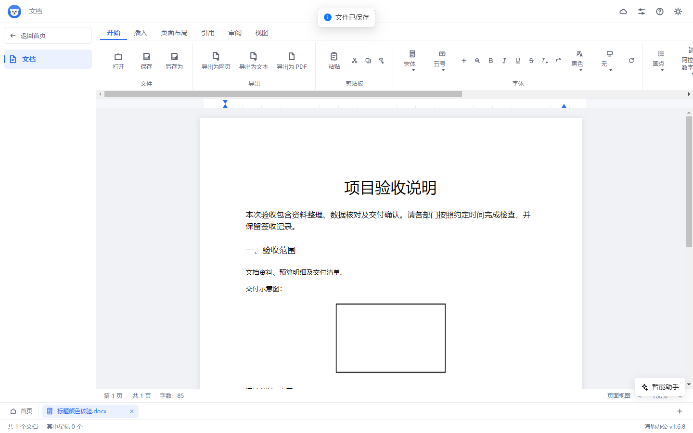

# 1.6.8 标题颜色、主题入口与图片调整

## 标题颜色原因

编辑区保存模型原先只识别十六进制与 RGB 颜色，内联样式及旧式字体属性中的命名颜色 `black` 没有写入模型。DOCX 保存库又为没有明确颜色的一级至六级标题提供了默认蓝色。重新打开时读取器按照文件中的真实标题样式显示，因此出现黑色标题变蓝。

修复由两部分组成：浏览器验证并解析有效命名颜色，无效值和继承关键字不伪装为黑色；新写入 DOCX 的标题默认使用自动颜色，保留原有字号和字形，显式文字颜色优先。外部文档明确设置的蓝色或其他颜色继续读取，不根据色值猜测用户意图。旧文件若已经被旧版写入蓝色，需重新选择黑色并保存，无法从已丢失的设置推断原始颜色。

默认标题、命名黑色、旧式字体黑色、十六进制黑色及彩色混排均进行真实 DOCX 往返；五组用例连续保存重开三次。六级标题分别核验。首页打开与最近列表使用真实生成、真实解析的文件内容验证黑色和已保存标记。

## 图片操作

1. 点击正文内的图片，显示四角选框和图片工具条。
2. 拖动任意角等比调整尺寸；按 Esc、指针取消或窗口失去焦点可还原未完成的缩放。
3. 点击“尺寸”，按厘米输入宽度和高度。默认锁定纵横比；取消锁定后可分别输入。输入无效或超出正文、栏宽、单元格宽度时，使用统一错误弹窗说明原因。
4. 直接拖动图片到正文位置，或点击“移动图片”后点击正文目标位置；移动原图片，不复制媒体，不删除目标文字。
5. “左对齐”“居中”“右对齐”将图片独立一行，保留前后正文与字符格式；简单表格单元格内的图片也可以调整。
6. 每次完成的图片操作进入撤销历史和未保存状态；撤销可恢复原内容与保存状态，重做可重新应用。只读时隐藏修改入口，切换文档或原图片节点失效后清除选中。

图片继续采用正文内嵌模型。任意浮动环绕、叠放、裁剪和特效没有进入可用操作入口；已有文件包含这些内容时仍按兼容范围提示。PNG、JPEG、GIF、BMP 原始媒体字节、位置顺序、尺寸和说明随受支持的 DOCX 保存重开。

## 设计令牌

- 图片控件使用现有品牌色、背景、边框、正文和次要文字变量；间距沿用 4、8、12、16 像素。
- 工具条使用 6 像素圆角，尺寸弹窗使用现有 8 像素圆角及统一按钮区；缩放标记为 8 像素，指针操作区域为 24 像素。
- 文档纸张增加独立的白色纸张与黑色默认墨色令牌，界面深浅主题不改变文档颜色；页面自定义底色继续保留。
- 顶栏主题按钮沿用 30 像素控件、18 像素线性图标、6 像素圆角、8 像素间距，固定在所有页面的最右端。

## 界面自检评审

1. 若选中框和操作按钮写在正文里，可能污染保存文件。选框、工具条和尺寸弹窗放在正文外层，保存链路只收集文档内容。
2. 图片处于视口边缘或正文缩放后，浮层容易脱离图片或越界。浮层依据实际图片矩形更新，跟随滚动和窗口变化，工具条限制在视口内并允许换行。
3. 操作后切换标签或撤销可能留下无效选框。切换文档、只读变化及原节点失效时主动清除选中；取消缩放还原原属性。
4. 原先深色界面将默认正文改成浅色，同时显式黑色仍是黑色，文档内容对比度不一致。文档纸张和墨色采用独立令牌，两种界面主题中的文档颜色一致。

## 自动化验证

类型检查、生产构建、渲染层 1069 项、主进程 293 项、打包清单 2 项，共 1364 项测试通过。图片新增尺寸合法性、原子失败、文字格式保留、表格位置、正文范围校验、真实 DOCX 连续往返、缩放提交和取消、精确宽高、只读切换、点击移动、拖放、撤销与保存状态测试。

完整测试中发现 PDF 页数显示与页面读取效果的异步时序不同；对应测试改为等待实际读取调用，不修改 PDF 实现，也不降低原断言。

## Windows 成品

版本 1.6.8，构建目录为 `release/v1.6.8/`，包含 x64 安装版、便携版及解包目录。源码及文档进入 Git 仓库，构建产物作为发布附件提供。

解包版与便携版分别完成真实文件读取、图片缩放至 240×160、独立居中、撤销重做、保存落盘、关闭标签、首页打开、最近列表重开和正常退出。重开的显式黑色标题为黑色，默认标题为黑色，红色强调文字保持红色；图片尺寸、段落对齐和媒体字节一致，没有导入警告或未保存标记。两份成品的 35 个文件完整性检查全部通过。

验收仅替代原生文件选择器返回的文件路径，首页按钮、主进程文件读取与解析、保存指纹保护、编辑器及最近文件操作都使用真实成品链路。没有执行安装向导；安装版完成生成和文件校验。

| 文件 | 字节数 | SHA-256 |
| --- | ---: | --- |
| SealOffice.1.6.8.exe | 87992362 | B756F343304E50BB52A59896021CF28EE90AA8D2DFF349EA91EC3B4126918122 |
| SealOffice.Setup.1.6.8.exe | 88217995 | 377F4783B4005B94E698701A5852F26E8E49C6BE208F9FC8711C7974550EA399 |

已发布到 [GitHub 1.6.8 发布页](https://github.com/fangzhouxiaohai/seal-office/releases/tag/v1.6.8)。两份附件的服务器端大小与 SHA-256 均与上述本地构建匹配；README 下载链接已同步到该版本。

软件截图：

