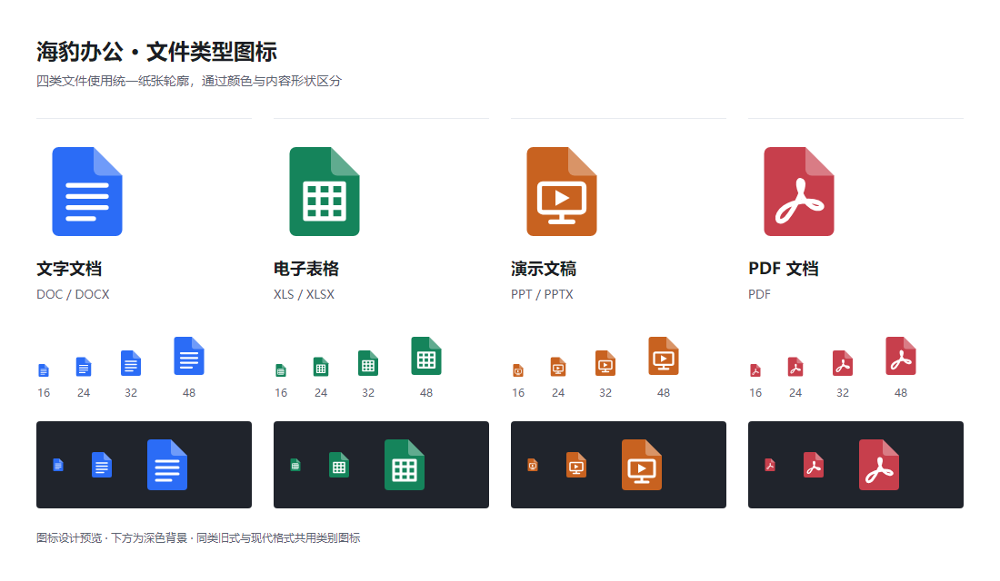

# 1.7.2 专属文件类型图标

## 修改

| 文件类别 | 扩展名 | 图标 |
| --- | --- | --- |
| 文字 | DOC、DOCX | 蓝色纸张与文字行 |
| 表格 | XLS、XLSX | 绿色纸张与网格 |
| 演示 | PPT、PPTX | 橙色纸张与播放屏幕 |
| PDF | PDF | 红色纸张与曲线 |

四类采用一致的折角和轮廓，图形与颜色由共享设计文件维护。首页、最近文件、底部标签与 Windows 图标保持一致。应用自身的海豹品牌图标不变。

## 安装、升级与关联

安装版提供稳定的外置图标资源；安装及升级为七种新建类型注册对应类别图标，并刷新 Shell 关联。手动设置默认程序通过同一注册脚本使用这些资源。注册前检查外置图标与应用内可信资源逐字节相同，缺失或修改明确报错。

便携版手动关联时先把四类图标保存到应用持久数据目录，Windows 注册路径不会指向临时解包目录。便携程序自身需保留原始下载文件的位置；移动后可重新设置默认程序。持久资源是用户应用资料，卸载不会额外删除用户设置目录。

Windows 10／11 的实际默认程序仍由用户在系统页面确认。只有已关联到海豹办公的文件才使用对应图标；其他办公软件的关联不会被覆盖。DOC、XLS、PPT 当前仅提供真实空白模板和备用类别图标，未增加旧式文件编辑能力。

## 图标资源

每类 ICO 包含 16、20、24、32、40、48、64、128、256 像素透明 PNG 帧。维护时运行 `npm run icons:files`，使用项目已有 Electron 渲染 SVG，不需要额外图像转换工具。原始设计、SVG、PNG、ICO 与生成器全部入库。

## UI 自检评审

1. 原类型图标主要依靠外部颜色，底部标签未传颜色时辨识度不足。修复：文件类别自行提供默认颜色，最近列表从同一设计读取颜色。
2. 原 PDF 只有空白纸张与折角，小图容易与一般文档混淆。修复：增加独立曲线标记，四类同时以颜色和形状区分。
3. 原四类轮廓与内容比例不统一，折角仅部分图标存在。修复：共用纸张和折角定义，内容限定在统一区域；小尺寸移除文字，使用简洁内容形状。
4. 首次预览裁切了底部说明。修复：扩大画布并检测实际非空绘制，保留完整大小图与深浅背景。

已直接审阅实际生成预览，检查小图、默认颜色、深色背景和完整边界。交互布局沿用原组件，未新增弹窗或按钮。
