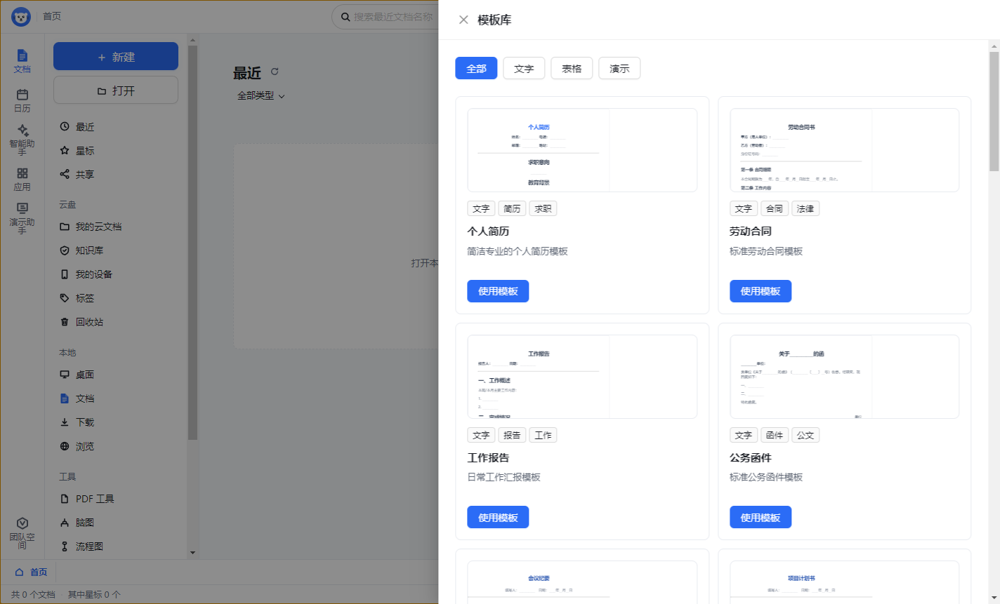

# 1.8.1 打印与模板升级

本版将首页左侧“新建”改为居中弹窗，提供文字、表格、演示和模板库四个入口。选择后关闭弹窗，再进入对应编辑器或模板库。

文字、表格、演示以及 PDF 工作区均增加“打印”入口。文字使用当前编辑区正文；表格打印当前工作表的有效数据范围；演示打印整份文稿的全部幻灯片；PDF 打印所选文件。原生打印对话框负责选择打印机及纸张，取消不会报告为失败。文字、表格和演示支持 `Ctrl+P`，表格快捷键在工作表焦点内生效。

模板库从 10 个扩展到 21 个模板，增加会议纪要、项目计划书、商业提案、周报、项目预算、销售跟进、考勤记录、任务看板、项目汇报、季度总结、创业路演。文字模板写入多章节正文，表格模板写入可编辑单元格及部分公式，所有演示模板创建封面和三张可编辑的内容页。卡片增加缩略预览，选择模板后直接使用这些内容新建文件。

自动化验证覆盖模板内容非空、表格解析、演示页数、首页新建弹窗、模板选择、打印主进程回调及临时文件清理。Windows 成品验收还检查弹窗、模板预览、各类打印入口、文件编辑保存重开和安装完整性。真实纸张输出取决于用户设备及打印驱动，自动化环境仅验证打印任务入口与原生回调。

## 安装包

| 文件 | 字节数 | SHA-256 |
| --- | ---: | --- |
| `SealOffice Setup 1.8.1.exe` | 88,580,849 | `7BFEEF03AFF90FBBD10178EBDFAB39EC8115C761B0844FF9D7945BBC7CA11E76` |
| `SealOffice 1.8.1.exe` | 88,355,450 | `5CD5B6912CCC55B56FF630F86AD511DBEF4EEDDED6D586EFA7C6C56FFB8587E1` |

`npm run typecheck`、生产构建和完整自动化测试通过：渲染层 1,590 项、主进程 851 项、打包校验 2 项。解包版与便携版各完成三次启动验收。
