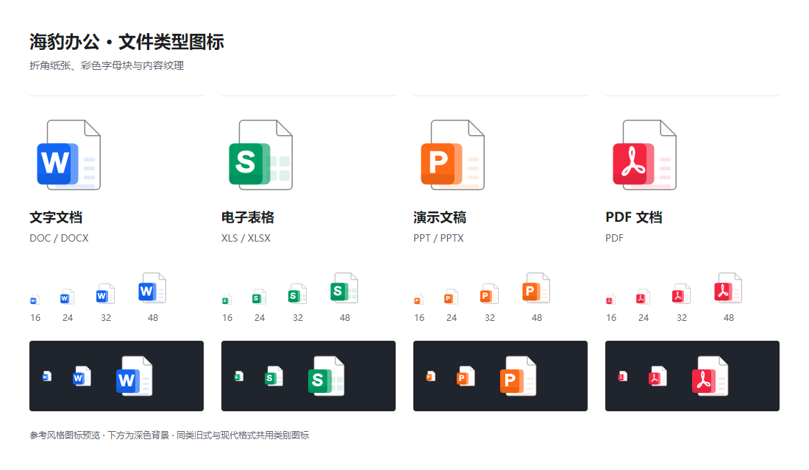
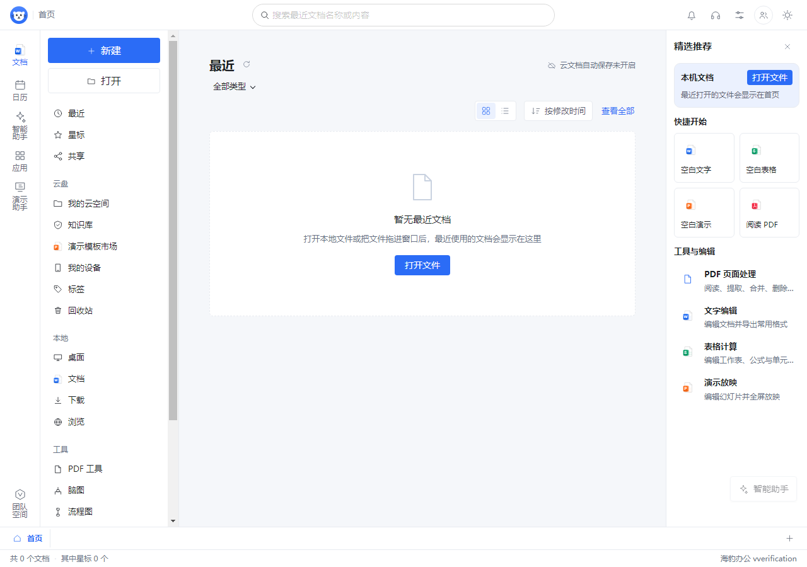
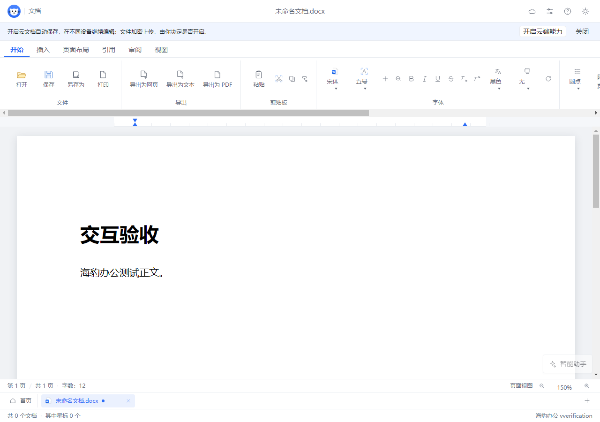
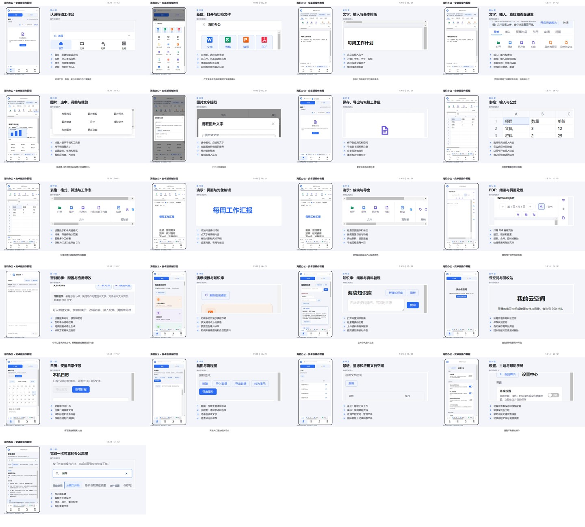

# 海豹办公 1.9.10：双端图标、扁平界面与移动办公

本版接入用户确认的 PC / 移动端两套程序图标，并统一 PC 扁平界面；修复设置默认程序时的 Windows 通知超时。加入 uni-app x 移动端项目，复用桌面编辑器和文件编解码能力；完善 Word 图片的本地编辑及文字提取入口。Windows 文档默认缩放为 150%，统一原生输入框和按钮的基础样式，并更新默认程序关联的文件类型图标。

## 桌面体验

- Word、表格、演示、PDF 首次打开默认 150%；Ctrl + 滚轮及缩放按钮继续可用。手机正文仍按窄屏重排。
- 四种关联图标统一为白色折角纸张，搭配蓝色 W、绿色 S、橙色 P 和红色 PDF 标记；ICO 包含 16–256 px 九种尺寸，页面与系统关联共享图形设计。
- 原生按钮、文本输入、数字输入、选择框、文件与颜色选择入口补齐主题、焦点和禁用状态，保留已有组件的专用样式。

用户确认的 [两套界面图标效果稿](../opendesign/mockups/ui-icons/README.md) 已接入程序，共 127 组 PC / 移动 SVG。PC 功能区使用细线条及局部彩色点缀，移动端文件使用彩色分层方块、功能入口使用彩色图形，底部导航保持单色轮廓与蓝色选中状态。紧凑按钮修正内边距，并阻止 SVG 被 flex 布局挤小；重复图形的裁切 ID 独立，避免图标消失或串用。

PC 首页、功能区、设置、模板、列表、卡片和浮动工具栏统一为平面背景、细边框、小圆角和轻阴影，保留浅色、深色、焦点及禁用状态。独立检查确认 Word 正文、表格单元格与演示对象的关键计算样式不受界面皮肤影响。

### 默认程序关联修复

复现截图中的超时：同步关联刷新及向全部窗口广播系统消息，在这台机器上耗时 58,697 毫秒，超过执行器的 30 秒限制。改为 `SHCNF_FLUSHNOWAIT` 异步通知并移除多窗口超时广播后，同一通知降至 89 毫秒。该测量只发送刷新通知，没有改动用户默认应用。

关联操作注册 DOCX / XLSX / PPTX / PDF 的打开能力，再通过系统接口回读实际默认程序。尚未全部关联时打开 Windows 默认应用页面，专属页面不可用时退回默认应用列表；两个页面均失败则显示可操作的系统设置路径。受保护的用户选择保留，由 Windows 确认；只有回读全部生效才提示完成。85 项沙箱原生注册检查覆盖能力注册、保留默认值与用户选择、图标解析、升级迁移及卸载恢复。

通知行为依据 [Microsoft SHChangeNotify 文档](https://learn.microsoft.com/en-us/windows/win32/api/shlobj_core/nf-shlobj_core-shchangenotify)；移除广播依据 [Microsoft SendMessageTimeout 多窗口风险说明](https://learn.microsoft.com/en-us/windows-hardware/drivers/devtest/28602-avoid-calling-sendmessagetimeout-with-hwnd-broadcast)。

## Word 图片操作

PC 选中图片后显示八个尺寸手柄、旋转手柄，以及紧邻图片的工具栏。支持正文内移动、尺寸和角度输入、段落左中右对齐、预览、真实像素裁剪、翻转、删除、撤销与重做。移动端提供触摸移动、缩放和旋转，工具栏避开底部导航。

保存重开 DOCX 保留图片尺寸、旋转和翻转；PDF 导出在副本中将旋转、翻转写成实际像素，避免方向丢失。当前布局是段落内联布局，不包含浮动图片的环绕排版。

文字提取复用用户配置的图像识别接口，结果支持预览、复制和纯文本插入。此次验证使用接口模拟，不代表真实模型供应商已通过线上验收。AI 改图按用户选择后续接入。

## 移动端与视频

`mobile/` 包含 uni-app x 外壳、原生文件与请求桥接、Android 适配资源、网页构建、存储与安全配置、兼容性清单及测试脚本。默认 `pack` / `dist` 只执行 Android 打包；Windows 发布使用明确的 `dist:windows` 命令。

Android 配置为 minSdk 28 / targetSdk 36，包含 32 / 64 位 ARM。基于不同 ROM 的权限、文件 MIME、分享、返回、生命周期、键盘和安全区差异增加处理与验收入口；只有现有 Android 14 模拟器可用，不声称其他品牌、Android 9–16、iOS 27 和鸿蒙均完成原生实测。

本版移动端界面制作了 **1920 × 1080 横屏、12 分 09 秒、普通话柔美女声** 操作视频，共 21 章，覆盖新建与导入、文字排版和图片、表格公式、演示、PDF、智能助手、模板、知识库、云空间、日历、脑图流程图、保存恢复与设置。视频使用本版生产构建的安卓尺寸界面原型；系统文件选择为演示夹具，云服务与模型展示配置和入口，未伪造真实线上调用。最终 APK 的系统级操作仍以云打包后的实测为准。

[视频制作源码与复现方法](promo/mobile/README.md)。MP4、封面、字幕和完整媒体校验报告随本版发布附件提供；视频与音频全量解码、时长、尺寸、字幕时间及 SHA-256 均已核对。

用户将自行云打包并提供新版 APK。本次没有将旧 1.9.9 APK 当作 1.9.10 成品。收到后再核对版本、签名、ABI、内置资源与实际安装行为，上传同版本发布附件。

## 验证范围

| 核验 | 结果 |
| --- | --- |
| 前端全量回归 | 200 个文件、1,821 项全量基线通过；随后双端图标、设置及默认程序提醒相关用例另行复跑，37 项全部通过；具体数量同步 `mobile/verification.json`，原始报告保留在本机。 |
| 主进程全量回归 | 88 个文件、911 项通过，包含默认应用页面备用入口。 |
| 类型检查与打包配置 | 桌面及移动 Web 类型检查通过，打包清单 2 项通过。 |
| 移动基础 | 存储、加密、原生请求、文件类型、视口与打包 7 项通过。 |
| 生产浏览器 | HTTP 与 file 两种页面各 17 组通过，均无捕获到的控制台错误；含中文 DOCX / XLSX / PPTX 往返、PDF、持久保存、恢复、图片操作和 360 / 390 / 820 / 1280 px 布局。 |
| 桌面界面巡检 | 96 个页面、主题与宽度组合，检查 5,861 个控件；15 条真实交互流程通过。服务端响应使用隔离夹具。 |
| 图标与正文样式 | 254 个 PC / 移动 SVG 均有有效图形范围；8 组紧凑按钮尺寸及 6 组正文/对象计算样式比较通过。 |
| Windows 原生注册 | 85 项通过，使用独立测试注册表根，不变更真实默认应用。 |
| Android 编译 | UTS → Kotlin 和包内资源检查通过，此检查不生成 APK。 |
| Windows 成品启动 | 展开程序及最终便携版各三次启动，分别通过 15 / 11 / 32 项检查，均正常退出。 |
| 成品文件编解码与打印 | 8 组通过，覆盖 DOCX、XLSX、PPTX、PDF 与实际打印预览。 |
| EXE 完整性 | 安装版、便携版内嵌程序与验收版 `app.asar` 的 SHA-256 一致。 |
| MSIX 完整性 | 90 个程序文件、97 个包内文件核对通过；版本 1.9.10.0，保留原有商店身份，包结构与块映射有效。 |
| 教程媒体 | 21 章、729.333 秒、30 fps、1080p，全量解码通过；提供 246 条字幕和女声配音。 |

自动化巡检、共享编辑器测试和生产浏览器验收不能替代所有手机品牌的原生体验。真实账号、付费模型、不同 ROM、iOS / 鸿蒙签名与真机运行仍列为待验。详细边界见 [移动端兼容性与验收](../mobile/compatibility.md)。

详细可复查记录见 [图标与扁平界面验收](v1.9.10-图标与扁平界面验收.json) 和 [Windows 成品验收](v1.9.10-成品验收.json)。

## 成品交付

Windows x64 安装版、便携版和用于商店上传的 MSIX，附三个包的 SHA-256。MSIX 未签名且未提交应用商店，本次完成的是仓库预发布。源码和版本标签同步 GitHub、GitCode，二进制与教程媒体存放 GitHub Releases。

新移动端 APK 待用户提供；不同时生成 iOS 或鸿蒙安装包。
