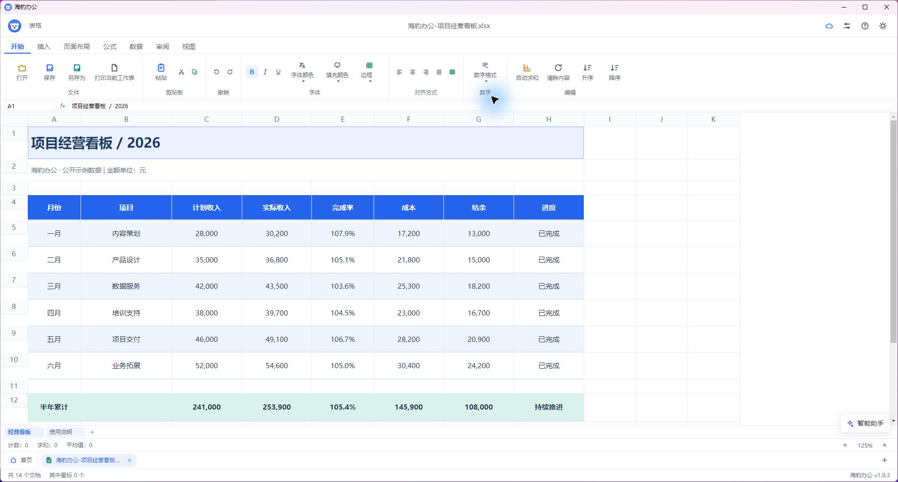

# 海豹办公 1.9.3 修复与验收

本版修复上架截图检查中复现的表格计算与合并标题问题，优化演示模板按钮，并统一无空格安装包名称。在线能力继续以预发布状态提供。

## 修复内容

- 表格公式以原始数值计算，再单独应用显示格式。带千位分隔符、货币和百分比格式的引用、合计与连续公式不再被显示文本干扰。
- XLSX 导出写入数值计算缓存，保存并重开仍可计算；导入的文本类型内容即使以等号开头也保持文本。
- 合并单元格按全部跨列宽度和跨行高度显示，标题不再被首列宽度裁切；隐藏行高度纳入处理。
- 百分比格式保留小数位，常规整数格式和细边框颜色支持导入、导出与重开。仍不支持的边框样式继续准确提示。
- 模板市场收藏按钮使用独立样式，图标与文字水平、垂直居中，统一高度、间距、边框、悬停和键盘焦点。模板封面样式不再影响收藏按钮。
- 安装版、便携版与微软商店包均使用无空格文件名。新增发布流程和发布脚本，要求同步代码、标签、安装包，并验证远端附件大小及 SHA-256 后发布。

## 实际验证

| 验证范围 | 结果 |
| --- | --- |
| 客户端表格、模板市场、助手文件创建相关回归 | 17 个文件、333 项通过 |
| 主进程回归 | 86 个文件、896 项通过 |
| 修改边框回归后的 XLSX 编解码复验 | 55 项通过 |
| TypeScript 类型检查 | 通过 |
| 打包检查 | 2 项通过 |
| 实际 app.asar 模块 | 100 个完整性文件校验通过；DOCX 图片及页眉页脚、XLSX 多表公式图片、PPTX 图片、PDF 编辑与页面操作、打印预览 PDF 检查通过 |
| 安装版与便携版 | 解压后内嵌 app.asar 与已验收成品一致 |
| 微软商店 MSIX | MakeAppx 语义检查通过，版本 1.9.3.0；90 个源负载文件哈希一致，包含有效 BlockMap |
| 实际安装版界面 | 已安装 1.9.3 的 app.asar 与验收成品一致；公开 XLSX 示例完成率 107.9%、累计 105.4%、累计结余 108,000，合并标题完整，显示 125% |
| 模板操作 | 实际界面按钮居中；预览后使用模板成功创建包含图片、图表、表格等内容的 9 页演示副本 |

回归新增真实 XLSX 经主进程导入、客户端计算、网格渲染、导出保存和重新导入的链路。修复前同一测试能够复现公式错误与合并宽度不足，修复后通过。

### 界面证据

另提供 5 张来自实际安装版的联想商店截图，按 1280×720 导出，每张小于 5 MB，仅保持比例缩小并添加中性边距，未合成或改写界面。

## 交付文件

| 文件 | 字节数 | SHA-256 |
| --- | ---: | --- |
| SealOfficeSetup1.9.3.exe | 96,182,523 | `e68fe856e5c705f3a4f7a3c0ff41db20cad54431b6cc9f0f47ef16e2a44dcd41` |
| SealOffice1.9.3.exe | 95,957,055 | `2150396664096a3063fd8b63fe1eca23716cd629daf941e8d498d91e97c74f35` |
| SealOffice1.9.3.msix | 174,636,720 | `783f18469591a8865d39f3f708431922d51814ad17e86d86c94dae61b23ba7f3` |

验收成品 app.asar SHA-256：`351e87715647512ca367fd5a88fe31f6b9a37a90102a2f3889f24ff13ef76cb0`。

## 验收边界

上述结论针对已执行的回归、成品模块与公开示例界面检查，不代表任意来源的所有办公文件均无兼容性差异。真实短信收取和运营商报备、旧二进制 DOC/XLS/PPT 的外部转换服务、实体打印机以及未提供的原始异常文档仍需对应环境或样例验收。

EXE 仍未做发行者代码签名；MSIX 为微软商店上传包，沿用既有产品身份，不用于直接双击安装。仓库发布与商店提交审核分别核验，本报告不表示商店审核已提交或通过。
