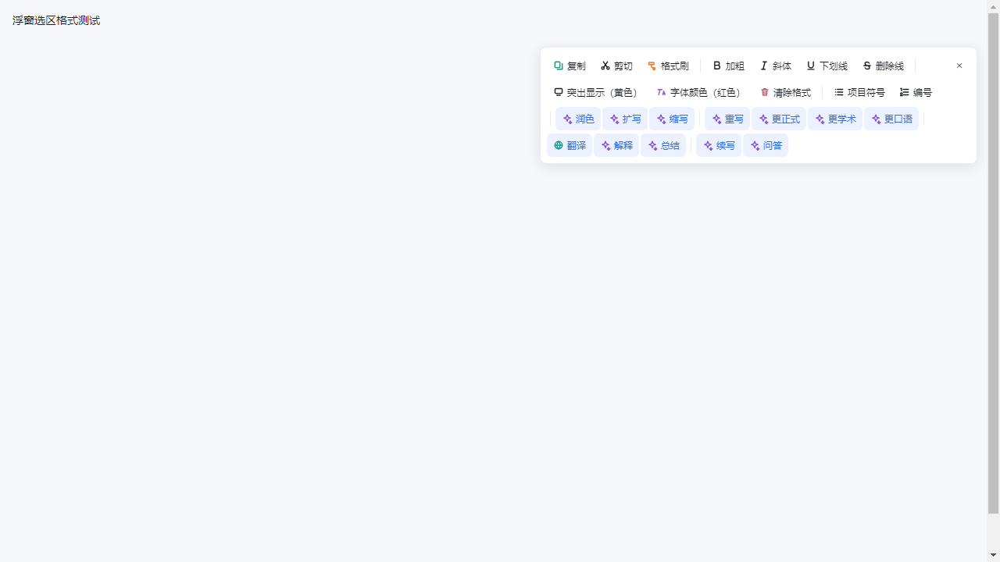
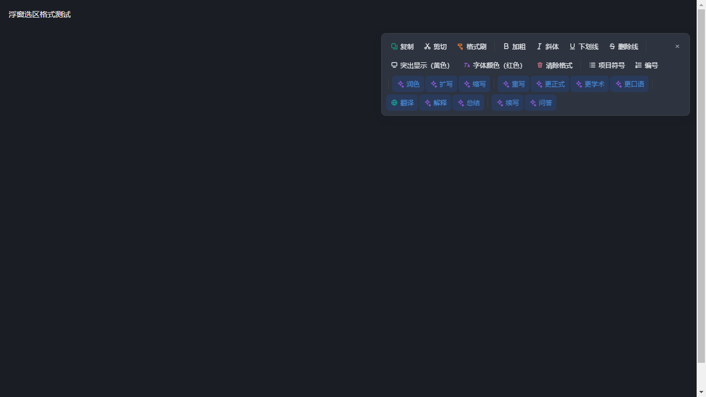

# 海豹办公 1.9.4 修复与验收

本版修复用户截图中选区悬浮菜单横向越界、部分操作与关闭按钮不可见的问题。保留 1.9.3 的表格公式与模板按钮修复，默认文件显示比例仍为 125%。

## 修复内容

- 菜单最大宽度为 560 像素，并根据窗口宽度收缩；操作按钮自动换行，窗口高度不足时可在菜单内部滚动。
- 根据渲染后的真实宽高定位，保持视口边距；优先显示在选区上方，上方不足时显示在下方。
- 菜单挂载至页面根层，避免编辑页面的缩放变换、滚动容器和裁切影响固定定位。
- 关闭按钮固定在菜单右上角；菜单内部滚动不会关闭菜单，文档滚动和 Esc 仍按原规则收起。
- 补齐实际 SVG 操作图标，包括演示对象前后图层图标；AI 快捷动作增加品牌色背景，兼容浅色与深色主题。
- 四类文件共用修复：文字、表格、演示和 PDF 的按钮仍调用各自的命令和助手入口，点击菜单保留当前选区。

## 验证结果

| 范围 | 结果 |
| --- | --- |
| 悬浮菜单及四类编辑器回归 | 5 个文件、20 项通过 |
| 真实 Electron / Chromium 渲染 | 48 种组合通过：文字、表格与演示的真实动作列表 × 4 种视口（1280×720、768×480、480×320、320×180）× 浅色/深色 × 上部/底部选区 |
| 缩放与容器裁切 | 测试中菜单所属容器设为 125% 变换并裁切，菜单仍位于根层；所有操作和关闭按钮均可触达 |
| 浏览器实际格式操作 | 保留选区，加粗成功写入正文，关闭按钮成功收起菜单 |
| 主进程回归 | 86 个文件、896 项通过 |
| TypeScript | 通过 |
| 打包检查 | 2 项通过 |
| README 图片 | 26 张图片存在、格式有效且已入库 |
| 成品 app.asar | 100 个完整性文件校验通过；DOCX 正文图片及页眉页脚保存重开、XLSX 多表公式图片、PPTX 图片、PDF 编辑及页面操作、真实打印预览 PDF 检查通过 |
| 安装版与便携版 | 解压后内嵌 app.asar 与已验收成品一致 |
| MSIX | MakeAppx 语义检查通过；身份沿用既有商店产品，版本 1.9.4.0；90 个源文件、97 个总负载文件哈希一致，含有效 BlockMap |

真实渲染检查使用 `scripts/verify-float-panel-layout.cjs` 加载本仓库的实际组件、动作定义与样式，在隔离的离屏窗口执行。以下图片是该组件的渲染验收截图，不是已安装客户端或商店宣传截图。

## 安装包

三个包均已生成并通过成品内容校验；发布页同时提供 SHA256SUMS.txt。所有安装包文件名均不含空格。

| 文件 | 字节数 | SHA-256 |
| --- | ---: | --- |
| SealOfficeSetup1.9.4.exe | 96,180,783 | `f634270c244a3370169be22cf8512fc02a6189e79d9af76d352a2b3ebce29e04` |
| SealOffice1.9.4.exe | 95,955,304 | `4bab923bdf693f7fd0b80d9af8364c2f7cb52d3fb6b41650eb58a4358705d4a5` |
| SealOffice1.9.4.msix | 174,640,323 | `020981c2dab4371411ff6f8283fb83eb74d7b05158ddd59023b765f5a3e1124a` |

验收成品 app.asar SHA-256：`065023f6f4c84caaf6412bf4c6413c8712f2555d81d588c39f01510a7700a836`。

## 交付边界

安装包上传 GitHub Releases，源码和版本标签同步 GitHub 与 GitCode。仓库发布与商店审核是两个独立步骤，本版报告不表示已向微软或联想商店提交审核。

线上能力继续保留预发布状态。EXE 未做发行者代码签名；MSIX 沿用既有微软商店产品身份，是商店上传包。上述测试覆盖本次菜单缺陷与相应回归，不代表所有来源文件均无兼容性差异。
