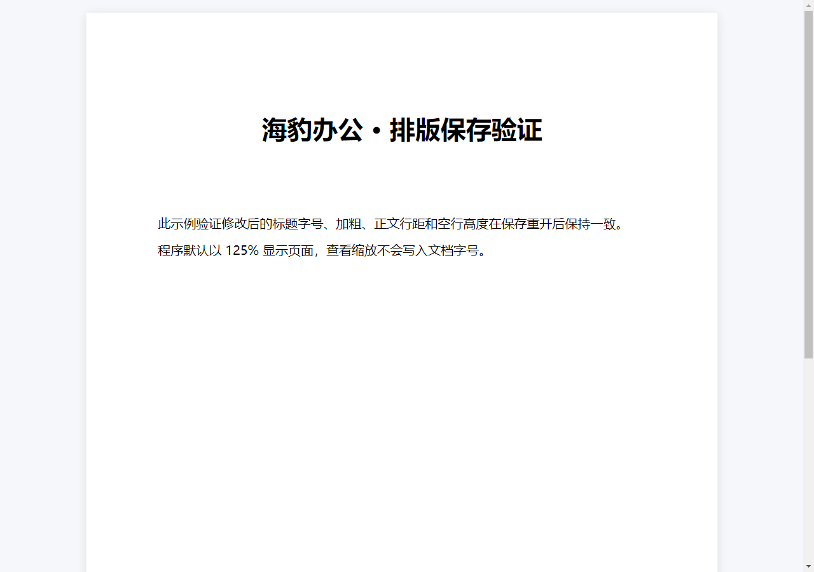

# 海豹办公 1.9.5 修复与验收

本版修复 DOCX 修改格式后保存重开，标题字号、加粗与正文位置变化的问题。默认查看比例继续为 125%，保留此前悬浮菜单、表格公式与模板按钮修复。

## 修复内容

- 保存时测量编辑器实际采用的字体格式，补齐标题标签、浏览器字号关键字和相对字号，避免写入后重新套用另一组标题字号与加粗。
- 校正 CSS 字号关键字和旧式字号档位的磅值换算，支持四分之一磅等实际字号，不再提前舍入而改变文字宽度。
- 保留段落标记字体，空行字号、行距、段距与相对缩进在重开后保持；页眉页脚使用自身字号基准。
- 保留表格宽度、单元格宽度、内边距、边框、底色及垂直对齐；根据纸张、方向、边距与分栏测量布局。百分比表宽同时识别 OOXML 的百分号和五十分之一百分比两种写法。
- 移除表格后无条件添加的空段落；仅在相邻表格间插入可识别的隐藏分隔，避免反复保存不断增加空行。
- 正确解码再转义 XML 文本，`&`、尖括号、引号与文字形式的实体不再重复转义。字体名称仍按 CSS 字符转义处理。
- 测量树不复制资源地址、事件和可执行标签，测量完成即移除；保存不会改变正在编辑的 DOM。

## 验证方式与范围

使用 `scripts/verify-document-roundtrip.cjs` 在隔离的 Electron / Chromium 离屏窗口加载本仓库的编辑器样式、真实保存转换器及文件读写模块。读取用户提供的实际 DOCX，测试原样保存，以及将标题改为 24 磅加粗后的保存。

每组样例连续保存重开三次，核对全文、段落数量、每个文字片段的字号、加粗、倾斜、颜色，以及文字和段落的边界坐标。坐标容差为 1 像素，测试显示比例为 125%。同时覆盖默认和修改后的标题、字号关键字与相对字号、空行、混合格式、列表、普通表格、带格式表格、合并单元格、A5 和自定义页面、特殊符号、页眉与页脚。

用户样例只用于本机验收，不放入仓库或公开发布附件。下面两张图使用通用测试文案，是隔离渲染验收截图，不是已安装客户端或商店宣传截图。

### 保存前

### 连续三次保存重开后

两张通用样例截图的 PNG 哈希一致；用户文档修改标题后的前后截图哈希也一致。整个文档的文本和段落位置另外通过逐项检查，截图仅展示当前视口。

## 成品检查

| 范围 | 结果 |
| --- | --- |
| 客户端全量回归 | 190 个文件、1744 项通过 |
| DOCX 保存格式专项 | 5 个测试文件、100 项通过 |
| 真实 Chromium 保存重开 | 15 组样例 × 3 次，共 45 次通过；包含用户实际文件及修改标题后的版本 |
| 主进程全量回归 | 86 个文件、896 项通过 |
| TypeScript | 通过 |
| 打包规则测试 | 2 项通过 |
| README 图片 | 26 张图片存在、格式有效且已入库 |
| 成品完整性 | app.asar 的 100 个文件校验通过 |
| DOCX 成品模块 | 正文图片、页眉页脚保存重开；成品读写模块另外通过上述 45 次真实渲染检查 |
| XLSX 成品模块 | 多表、公式、图片；字体字号、颜色、填充、边框、对齐、行列尺寸、冻结、公式与图片连续三次保存重开 |
| PPTX 成品模块 | 三页文字、图片；字号、加粗、斜体、下划线、颜色、对齐、图片及备注连续三次保存重开 |
| PDF 与打印 | PDF 文字编辑、旋转、插入与删除页面保存重开；生成真实打印预览 PDF |
| 两个 EXE | 解压后的内嵌 app.asar 哈希与验收成品一致 |
| MSIX | MakeAppx 语义验证通过；版本 1.9.5.0，90 个源文件、97 个总负载文件哈希一致，包含 BlockMap |

成品文件检查使用 `scripts/verify-packaged-codecs.cjs`。上述文件编解码检查不是对已安装客户端全部界面的逐个点击验收。

## 安装包

| 文件 | 字节数 | SHA-256 |
| --- | ---: | --- |
| SealOfficeSetup1.9.5.exe | 96,183,819 | `3afe9f5b5c2214dd658fe912fac2851c13de0aaaac0f4b4fede97b1918c878c7` |
| SealOffice1.9.5.exe | 95,958,398 | `fda090f079f961cc4ee519d31d58427a8e707103045ea6e8c11936dedfc75976` |
| SealOffice1.9.5.msix | 174,641,484 | `2922a11fdfca729ef52b621f25375e4782dde5ec10d77fc4d5424bd866534b00` |

验收成品 app.asar SHA-256：`180bab71c2cf4ff065bf111c8dc1658369d24b8bca925fb1838edcdb27a69e59`。

## 交付说明

安装版、便携版与微软商店上传用 MSIX 的文件名均不含空格。源码和版本标签同步 GitHub 与 GitCode，安装包上传 GitHub Releases，并提供 SHA256SUMS.txt。

本次验证覆盖当前实现及上述格式、文件和操作，未承诺任意来源 Office 文件均无兼容性差异。原有导入风险提示与来源文件保护继续保留。云端仍为预发布能力，EXE 未做发行者代码签名，MSIX 使用既有商店身份、供合作伙伴中心上传。本次仓库发布不表示已提交微软或联想商店审核。
