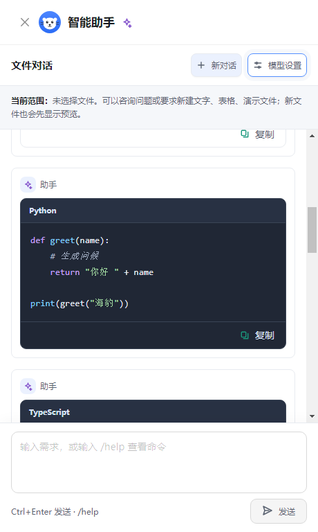
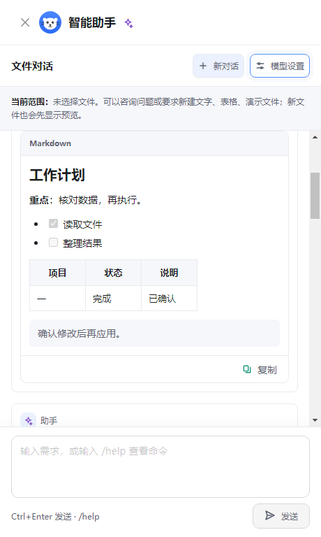
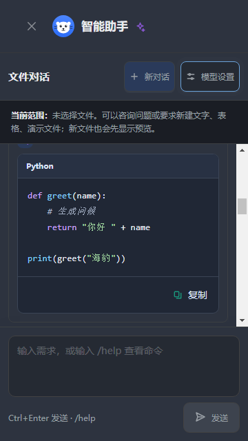

# 海豹办公 1.9.8 修复与验收

## 智能助手内容展示与布局

1. 回复按内容类型展示。代码按语言语法高亮，支持 Python、JavaScript、TypeScript、JSON、SQL、HTML、CSS、PowerShell 等常用语言；未知语言仍保留完整代码。Markdown 显示标题、加粗、斜体、引用、列表、任务项、表格和行内代码。普通文本保留换行、缩进和符号。
2. 内容区域独立成面板，复制按钮位于底部。代码复制正文，Markdown 复制原始语法，普通文本复制原文；混合回复的各代码块可独立复制，也可复制整段 Markdown。复制成功和失败都有反馈。
3. 修复旧解析器删除代码围栏的问题，流式输出与最终结果保留语言标记、缩进和换行。JSON 示例不会误当成文件修改协议；真正的修改协议继续校验类型、数量与修改参数。未完成的协议不会把修改 JSON 直接展示给用户。
4. 使用 Markdown 解析器识别内容，覆盖仅含斜体、引用链接、缩进代码等短回复；明确标为 TXT 的围栏保持原样，明确标为 MD 的围栏按 Markdown 排版。
5. 默认思考强度、思考模式与上下文说明归入模型设置；“仅生成计划”移入同一设置面板。已发送或排队的任务沿用提交时的设置。
6. 移除聊天列表的高度上限，使聊天区延伸到消息输入框上方；模型设置有独立滚动区域，收起后恢复对话。长代码和宽表格在面板内部滚动，输入框保持可用。
7. 增加海豹头像、消息标识，调整新对话、设置切换、发送和复制按钮的颜色、圆角及图标；保留浅色、深色和减少动画偏好。

模型返回的代码只作为内容展示，不执行。Markdown 不运行原始 HTML；外部链接由系统浏览器打开，远程图片不自动加载。文件修改仍先显示候选，用户确认后才应用。

## 界面示例

下图来自真实组件在隔离 Chromium 中的截图，内容使用测试数据。







## 验收结果

| 检查 | 结果 |
| --- | --- |
| TypeScript 类型检查 | 通过 |
| 客户端完整回归 | 196 个测试文件，1799 项通过 |
| 主进程完整回归 | 86 个测试文件，898 项通过 |
| 服务端回归 | 10 项通过 |
| 内容展示与复制回归 | 13 项通过，包含短 Markdown、混合代码块、复制失败重试和危险内容 |
| 最终助手全部复测 | 12 个测试文件，97 项通过 |
| 模型设置与真实请求链路 | 设置的思考强度传给下一次请求；后台完成后恢复结果、新对话清理结果通过 |
| 助手真实 Chromium 展示 | 两种主题 × 六种窗口尺寸，共 12 组通过 |
| 四类文件 AI 行为 | 文字、表格、演示、PDF × 深浅主题，共 8 组通过 |
| 全应用布局与状态 | 96 组检查，5841 次控件展示位置检查；15 条真实鼠标交互链路通过 |
| 包内文件功能 | 100 文件完整性清单、DOCX/XLSX/PPTX/PDF 保存重开与打印预览，共 8 项通过 |
| DOCX 排版往返 | 15 组样例，每组三轮，共 45 次通过 |
| 打包清单 | 2 项通过 |
| Windows 成品启动 | 首次、重复启动、确认设置，共 58 项检查通过；三次正常退出 |
| README 图片 | 28 张引用图片存在且已入库 |

真实 Chromium 检查覆盖 1366×768、1280×900、800×600、480×800、360×640、320×568：内容边界、对话区与输入框间距、复制按钮实际点击、模型设置开合与滚动、长代码以及宽表格。另验证分片代码输出到最终回复的语言高亮，并在输出过程中打开设置，任务完成后收起设置恢复结果、继续显示最新回复；阅读历史时开合设置保留阅读位置。

四类文件检查覆盖第一次快捷 AI 调用等待已保存设置、第一条需求直接执行、后续需求才排队、引导不重复执行、逐行工具记录与折叠任务计划。最终 Markdown 识别完善后再次运行全部助手相关测试和真实展示检查。

全应用检查覆盖首页、最近、星标、云空间、回收站、知识库、模板市场、日历、脑图、流程图、应用、本地目录、设置与四类编辑器，以及深浅主题、不同窗口和云空间状态。5841 是不同场景的累计控件展示次数，不代表 5841 个独立功能。

### 验收范围

UI 检查使用真实组件、状态层与样式；AI、桌面选择和云请求使用受控响应。文件往返与打印检查使用最终包内模块。实际模型供应商、真实短信送达、用户打印机及线上网络没有在本次逐项连接验收。

用户提供的文档仅用于本机排版往返核验；原文及副本未加入仓库、安装包或发布附件。

### 复现命令

```powershell
npm run typecheck
npx vitest run
npx vitest run renderer/src/assistant
npx vitest run --config vitest.main.config.js
npm --prefix server test
npm run test:packaging
node scripts/check-readme-images.cjs
npx electron scripts/verify-assistant-presentation.cjs .upgrade-private/assistant-presentation
npx electron scripts/verify-assistant-flow.cjs .upgrade-private/assistant-flow
npx electron scripts/verify-ui-experience.cjs .upgrade-private/ui-experience
npx electron scripts/verify-packaged-codecs.cjs release/v1.9.8/win-unpacked/resources/app.asar .upgrade-private/package-experience
npx electron scripts/verify-document-roundtrip.cjs .upgrade-private/document-experience
```

## 安装包与发布

提供安装版、便携版与微软商店上传用 MSIX，文件名均不含空格。两个 EXE 中的应用归档与已验证成品一致；MSIX 版本为 1.9.8.0，商店身份、块映射、90 个源程序文件与 97 个布局文件逐项核对。

源码与版本标签同步 GitHub 和 GitCode，安装包、SHA-256 校验文件和本说明同步 GitHub Releases。本次仓库发布不表示已提交应用商店审核。
