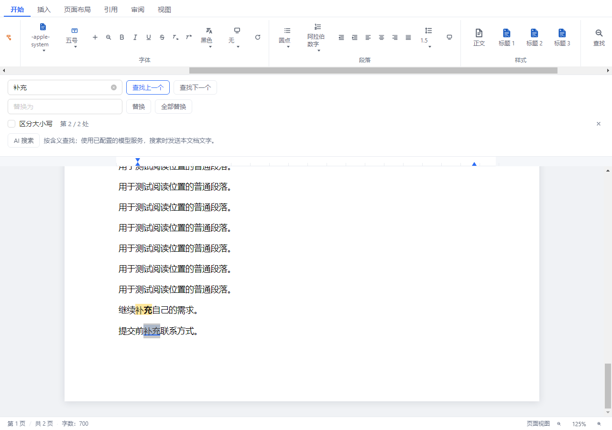
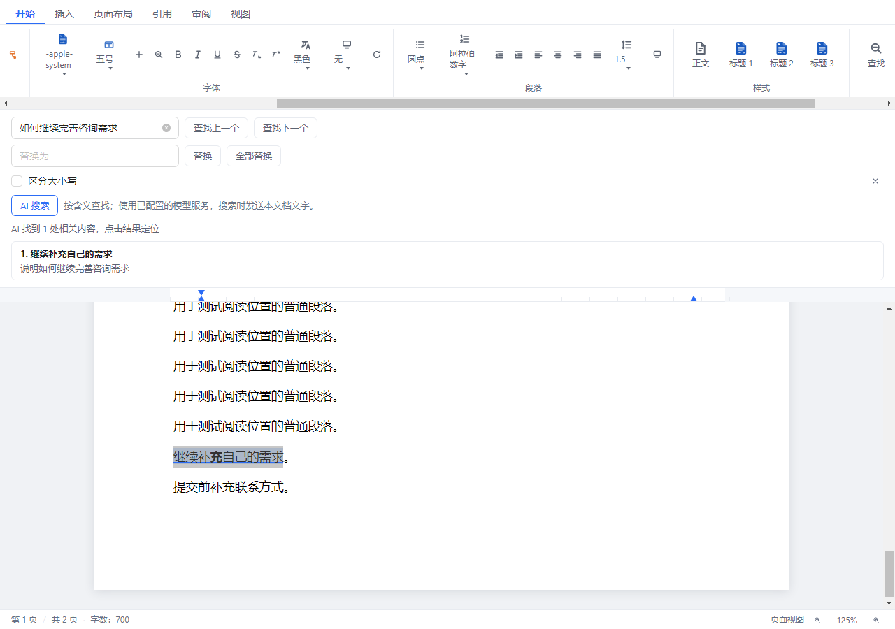

# 海豹办公 1.9.9：文档搜索定位、AI 搜索与目录导入修复

本版修复文字文档搜索只显示次数、无法跳转原文的问题，以及 Word/WPS 文档目录只剩页码、中文标题丢失的问题。

## 文档搜索

- Ctrl+F 打开查找，点击上一个、下一个，或在搜索输入框按 Enter、Shift+Enter，循环定位并选中实际命中内容。已有搜索可用 F3、Shift+F3 继续跳转。
- 显示当前序号和总数，高亮匹配文字；跨粗体、字体和超链接等内联格式的关键词也能定位，不将不同段落或换行的文字拼成误匹配。
- 定位实际文字行，兼容本版桌面运行环境的 CSS 缩放坐标；默认 125% 下也能把目标带入可见区域。
- 替换作用于当前命中项，全部替换从后向前执行；保留无关格式并支持撤销。搜索高亮不写入正文或保存文件。



## AI 搜索

查找面板新增 AI 搜索，可以输入含义或问题，按现有智能助手中的模型设置搜索本文档。点击相关结果可跳转并选中对应原文。使用时需要已配置可用的模型服务，搜索按钮旁说明会发送本文档文字。

长文件按完整文字分组搜索，不静默截断文件末尾；结果的编号和连续引用文字必须在本次文档快照中核实。搜索期间可以停止，关闭面板、改变查询或切换文档会取消任务；文件变化后须重新搜索。此功能通过专用只读用途调用现有模型通道，不开放文件修改工具。



截图来自真实组件在隔离 Electron 中的验收，文档与模型回复使用测试数据。AI 供应商线上响应未在本次验收中实际调用；测试覆盖现有模型通道、专用提示、JSON 解析、引用核实及点击定位。

## DOCX 目录

将单一域状态改为嵌套域栈，保留 TOC、HYPERLINK、PAGEREF 缓存结果，支持目录外层跨段落以及内层页码域，避免后出现的页码覆盖中文标题。保留制表分隔文字；数字样式编号通过样式名称和继承的大纲级别识别标题。

修复保存时四分之一磅字间距被舍入到 0.3 磅，以及制表符在不同 XML 写法间转换后显示宽度变化的问题。用户手册原样和编辑后连续保存、重开三轮，文字与段落数量保持一致，文字和段落布局偏差均在验收阈值 1 像素内。

目录以文件中已经计算好的标题和页码文字导入，当前版本不重新计算 Word 的动态目录页码或恢复其自动更新域。页码及总页数域继续按现有可写回方式处理。

## 验收

用户提供的手册仅用于本机只读复现与保存副本核验，原文件及副本不加入仓库、安装包或发布附件。

实际样本的 81 行目录逐行核对中文标题与页码，81 个大纲标题恢复；搜索“补充”找到 7 处，包括此前丢失的目录文字。浅色、深色的真实鼠标操作覆盖前后循环、跨格式选中、行级滚动、搜索不改正文，以及 AI 结果引用定位。

| 核验 | 结果 |
| --- | --- |
| TypeScript 与生产构建 | 通过；成品完整性清单含 100 个文件。 |
| 前端回归 | 全量覆盖 198 个文件；修正新增测试的按钮选择器后，变更的 3 个文件共 107 项最终复测通过，累计覆盖 1809 项。 |
| 主进程回归 | 87 个文件、902 项通过；最后的目录与制表符用例另行复测通过。 |
| 打包配置 | 2 项通过。 |
| 真实搜索界面 | 浅色、深色及用户手册 3 组通过；默认 125% 缩放下选区可见。 |
| DOCX 保存重开 | 源码及打包模块各 15 组、45 次检查通过，包含用户手册原样与编辑后的副本。 |
| 成品格式与打印 | 8 组通过，覆盖 DOCX、XLSX、PPTX、PDF 及真实打印预览。 |
| Windows 启动与界面 | 展开程序与最终便携版分别三次启动、58 项检查通过，均正常退出。 |
| EXE 完整性 | 安装版与便携版内嵌程序 SHA-256 均与已验收程序一致。 |
| MSIX 完整性 | 90 个程序文件、97 个包内文件逐个校验通过；版本 1.9.9.0，包结构与块映射有效。 |

## 复现命令

```powershell
npm run typecheck
npx vitest run
npx vitest run --config vitest.main.config.js
npm run test:packaging
npx electron scripts/verify-document-search.cjs .upgrade-private/search-ui
npx electron scripts/verify-document-roundtrip.cjs .upgrade-private/document-roundtrip
npx electron scripts/verify-packaged-codecs.cjs release/v1.9.9/win-unpacked/resources/app.asar .upgrade-private/package-codecs
```

## 成品

提供 Windows x64 安装版、便携版与微软商店上传用 MSIX，附 SHA-256 校验。源码、版本标签同步 GitHub 与 GitCode，安装包同步 GitHub Releases。本次仓库发布不代表已提交应用商店审核。
