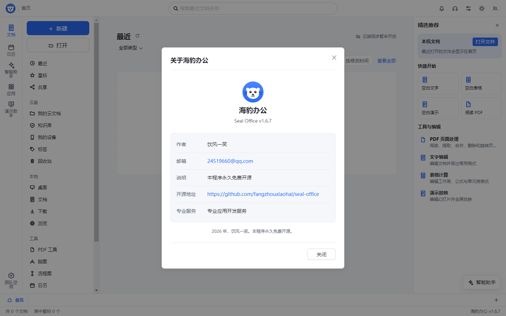

# 品牌图标统一与顶栏精简

## 范围

关于窗口使用与首页顶栏相同的蓝底海豹图标；所有页面顶栏移除英文品牌名称，保留图标、页面名、搜索或文件名及操作入口。

## 设计令牌

- 色彩：沿用现有 `--brand`、`--text-1`、`--text-2`、`--bg-card` 和 `--border`，标识复用 `SealLogo` 的蓝底版本。
- 间距：沿用 4、8、12、16、24、32 像素刻度，顶栏保持既有布局。
- 圆角与阴影：沿用现有弹窗和控件令牌，不新增装饰样式。
- 字体：沿用微软雅黑，标题 20 像素、600 字重，辅助信息 13 像素、400 字重。
- 标识：顶栏 28 像素，关于窗口 60 像素，造型和底色一致。

## 界面自检评审

1. 关于窗口的白色海豹轮廓与白色弹窗背景融合，辨识度低。恢复蓝色圆形背景，使完整轮廓可见。
2. 首页与关于窗口采用不同背景版本，品牌呈现不一致。两处复用同一标识组件的默认蓝底版本，仅按位置调整尺寸。
3. 顶栏英文名称重复表达品牌，并占用页面导航空间。移除该名称和对应的无效样式，保留图标的中文可访问名称与当前页面名。

完整实现位于 `renderer/src/components/AboutDialog.tsx`、`renderer/src/components/TitleBar.tsx` 和 `renderer/src/styles.css`。

## 验证

- 类型检查和生产构建通过，生成 35 个文件的完整性清单。
- 顶栏与应用外壳的 32 项现有测试通过。
- Windows 安装版、便携版和解包版重新打包完成，输出到 `release/branding-fix/`。
- 解包版与便携版实际启动核验：顶栏无英文名称，页面名保留，关于窗口标题正确，60 像素标识的造型及底色与顶栏一致。

